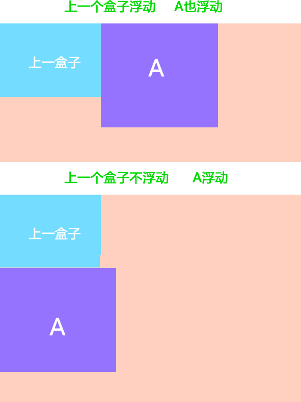

# 1.CSS基本概念

## 1.1 CSS的定义

CSS(Cascading Style Sheets)层叠样式表，主要用于设置HTML页面中的文本内容（字体、大小、对齐方式等）、图片的外形（宽高、边框样式、边距等）以及版面的布局等外观**显示样式**

## 1.2 CSS样式规则

CSS在书写时需要遵循一定的规范，也就是CSS的样式规则，具体格式如下：

```css
h1{font-size:12px;color:#f00;}
/* 选择器{样式属性1:属性值;样式属性2:属性值;...} */
```

在上面的样式规则中:

1. 选择器用于指定CSS样式作用的HTML对象，花括号内是对该对象设置的具体样式。

2. 属性和属性值以“键值对”的形式出现。

3. 属性是对指定的对象设置的样式属性，例如字体大小、文本颜色等。

4. 属性和属性值之间用英文“:”连接。

5. 多个“键值对”之间用英文“;”进行区分。

## 1.3 HTML页面引入CSS的几种方式

### 1.3.1 行内式（内联样式）

通过标签的style属性来设置元素的样式，其基本语法格式如下

```html
<div style="width:100px;height:100px;background-color:#fff">text</div>
<!-- <标签名 style="属性1:属性值1; 属性2:属性值2; 属性3:属性值3;"> 内容 </标签名> -->
```

语法中style是标签的属性，实际上任何HTML标签都拥有style属性，用来设置行内式。其中属性和值的书写规范与CSS样式规则相同，行内式只对其所在的标签及嵌套在其中的子标签起作用

### 1.3.2 内部样式表（内嵌式）

内嵌式是将CSS代码集中写在HTML文档的head头部标签中，并且用style标签定义，其基本语法格式如下:

```html
<head>
<style type="text/css">
    .a>div {
        height: 0;
    }
</style>
</head>
```

语法中，style标签一般位于head标签中title标签之后，也可以把他放在HTML文档的任何地方

### 1.3.3 外部样式表（外链式）

链入式是将所有的样式放在一个或多个以.css为扩展名的外部样式表文件中，通过link标签将外部样式表文件链接到HTML文档中，其基本语法格式如下：

```html
<head>
    <link href="CSS文件的路径" type="text/css" rel="stylesheet" />
</head>
```

该语法中，link标签需要放在head头部标签中，并且必须指定link标签的三个属性，具体如下：

-href：定义所链接外部样式表文件的URL，可以是相对路径，也可以是绝对路径。

-type：定义所链接文档的类型，在这里需要指定为“text/css”，表示链接的外部文件为CSS样式表。

-rel：定义当前文档与被链接文档之间的关系，在这里需要指定为“stylesheet”，表示被链接的文档是一个样式表文件。

### 1.3.4 导入式

导入式与链入式相同，都是针对外部样式表文件的，在css文本开头使用@import引入其他css文件的内容，其基本语法格式如下

```css
@import url(css文件路径);或 @import "css文件路径";
    /* 在此还可以存放其他CSS样式*/
```

# 2.CSS选择器

要想将CSS样式应用于特定的HTML元素，首先需要找到该目标元素。在CSS中，执行这一任务的样式规则部分被称为**选择器**

## 2.1 CSS基本选择器

### 2.1.1 标签选择器

标签选择器是指用HTML标签名称作为选择器，按标签名称分类，为页面中某一类标签指定统一的CSS样式

```css
h1 {font-size:12px;color:#f00;}
/* 标签名{属性1:属性值1; 属性2:属性值2; 属性3:属性值3; } */
```

### 2.1.2 类选择器

类选择器使用“.”（英文点号）进行标识，后面紧跟类名

```css
.name {font-size:12px;color:#f00;}
/* .类名{属性1:属性值1; 属性2:属性值2; 属性3:属性值3; } */
/* 标签调用的时候用 class=“类名”  即可 */
```

>注意：<br>
1.长名称或词组可以使用中横线来为选择器命名。<br>
2.不建议使用“_”下划线来命名CSS选择器。<br>
3.不要用纯数字、中文等命名， 尽量使用英文字母来表示。<br>
4.尽量不要使用标签名作为类名，比如 .p .h1 这是不合法的。

### 2.1.3 id选择器

id选择器使用“#”进行标识，后面紧跟id名

```css
#id {font-size:12px;color:#f00;}
/* #id名{属性1:属性值1; 属性2:属性值2; 属性3:属性值3; } */
```

>该语法中，id名即为HTML元素的id属性值，大多数HTML元素都可以定义id属性，元素的id值是唯一的，只能对应于文档中某一个具体的元素

### 2.1.4 通配符选择器

通配符选择器用“*”号表示，他是所有选择器中作用范围最广的，能匹配页面中所有的元素

```css
* {font-size:12px;color:#f00;}
```

## 2.2 CSS复合选择器

### 2.2.1 交集选择器

交集选择器由两个选择器构成，其中第一个为标签选择器，第二个为class选择器，两个选择器之间不能有空格

```css
p.name {font-size:12px;color:#f00;}
```

### 2.2.2 并集选择器

并集选择器（css选择器分组）是各个选择器通过逗号连接而成的，任何形式的选择器（包括标签选择器、class类选择器id选择器等），都可以作为并集选择器的一部分。如果某些选择器定义的样式完全相同，或部分相同，就可以利用并集选择器为它们定义相同的CSS样式

```css
div,.name,#id {font-size:12px;color:#f00;}
```

### 2.2.3 后代选择器

后代选择器又称为包含选择器，用来选择元素或元素组的后代，其写法就是把外层标签写在前面，内层标签写在后面，中间用空格分隔。当标签发生嵌套时，内层标签就成为外层标签的后代

```css
.name div {font-size:12px;color:#f00;}
```


### 2.2.4 子元素选择器

子元素选择器只能选择作为某元素子元素的元素。其写法就是把父级标签写在前面，子级标签写在后面，中间跟一个 > 进行连接

```css
.name>div {font-size:12px;color:#f00;}
```

>注意：这里的子元素是直接子元素，不包含孙子及之后的元素

### 2.2.5 伪类

伪类可以用于文档状态的改变、动态的事件等，例如用户的鼠标点击某个元素、未被访问的链接

- :link	    伪类将应用于未被访问过的链接
- :hover	伪类将应用于有鼠标指针悬停于其上的元素。
- :active	伪类将应用于被激活的元素，如被点击的链接、被按下的按钮等。
- :visited	伪类将应用于已经被访问过的链接
- :focus	伪类将应用于拥有键盘输入焦点的元素。（ie8以上支持）

链接伪类，他们规定执行有顺序的，不能随便更改位置：

要按照 :link --> :visited --> :hover --> :active 的顺序。

# 3.CSS三大特性

## 3.1 层叠性

所谓层叠性是指多种CSS样式的叠加。

比如先给某个标签指定了内部文字颜色为红色，接着又指定了颜色为蓝色，此时出现一个标签指定了相同样式不同值的情况，这就是样式冲突。

**一般情况下，如果出现样式冲突，则会按照CSS书写的顺序，以最后的样式为准。 (前提是用于设定该样式的两个选择器优先级相同)**

## 3.2 继承性

所谓继承性是指书写CSS样式表时，子标签会继承父标签的某些样式，如文本颜色和字号。想要设置一个可继承的属性，只需将它应用于父元素即可。

>并不是所有的CSS属性都可以继承，例如，下面的属性就不具有继承性：边框、外边距、内边距、背景、定位、元素高

## 3.3 优先级

定义CSS样式时，经常出现两个或更多规则应用在同一元素上，这时就会出现优先级的问题

此时，就要考虑选择器的权重大小，权重大的选择器优先级高，它设置的样式就会生效

关于css权重，我们需要一套计算公式来去计算，这个就是 CSS Specificity，我们称为CSS 特性或称非凡性，它是一个衡量CSS值优先级的一个标准 具体规范入如下：

specificity用一个四位的数 字串(CSS2是三位)来表示，更像四个级别，值从左到右，左面的最大，一级大于一级，数位之间没有进制，级别之间不可超越

- 继承或者* 的贡献值0,0,0,0

- 每个元素（标签）贡献值为0,0,0,1

- 每个类，伪类贡献值为0,0,1,0

- 每个ID贡献值为0,1,0,0

- 每个行内样式贡献值1,0,0,0

- 每个!important贡献值∞ 无穷大

>**注意**： 数位之间没有进制 比如说： 0,0,0,5 + 0,0,0,5 =0,0,0,10 而不是 0,0, 1, 0， 所以不会存在10个div能赶上一个类选择器的情况

# 4.字体样式属性

## 4.1 font-size:字号大小

font-size属性用于设置字号，该属性的值可以使用相对长度单位，也可以使用绝对长度单位。其中，相对长度单位比较常用，推荐使用像素单位px，绝对长度单位使用较少

单位：
- em 相对父元素文本字体大小，如果父元素没有设置字体大小，则一直往上找，如果都没有，则按浏览器默认字体大小设置
- px 像素
- in 英寸
- cm 厘米
- mm 毫米
- pt 点

## 4.2 font-family:字体系列

font-family属性用于设置字体。网页中常用的字体有宋体、微软雅黑、黑体等，例如将网页中所有段落文本的字体设置为微软雅黑，可以使用如下CSS样式代码：
```css
p{ font-family:"微软雅黑";}
```
可以同时指定多个字体，中间以逗号隔开，表示如果浏览器不支持第一个字体，则会尝试下一个，直到找到合适的字体。

常用技巧：

- 现在网页中普遍使用14px+。
- 尽量使用偶数的数字字号。ie6等老式浏览器支持奇数会有bug。
- 各种字体之间必须使用英文状态下的逗号隔开。
- 中文字体需要加英文状态下的引号，英文字体一般不需要加引号。当需要设置英文字体时，英文字体名必须位于中文字体名之前。
- 如果字体名中包含空格、#、$等符号，则该字体必须加英文状态下的单引号或双引号，例如font-family: "Times New Roman";。
- 尽量使用系统默认字体，保证在任何用户的浏览器中都能正确显示。

>PS:使用 Unicode 写中文字体名称，浏览器是可以正确的解析的。 font-family: "\5FAE\8F6F\96C5\9ED1"，表示设置字体为“微软雅黑”

- 宋体-SimSun-\5B8B\4F53
- 新宋体-NSimSun-\65B0\5B8B\4F53
- 黑体-SimHei-\9ED1\4F53
- 微软雅黑-Microsoft YaHei-\5FAE\8F6F\96C5\9ED1
- 楷体_GB2312-KaiTi_GB2312-\6977\4F53_GB2312
- 隶书-LiSu-\96B6\4E66
- 幼园-YouYuan-\5E7C\5706
- 华文细黑-STXihei-\534E\6587\7EC6\9ED1
- 细明体-MingLiU-\7EC6\660E\4F53
- 新细明体-PMingLiU-\65B0\7EC6\660E\4F53

## 4.3 font-weight:字体粗细

字体加粗除了用 b 和 strong 标签之外，可以使用css 来实现，但是css 是没有语义的。

font-weight属性用于定义字体的粗细，其可用属性值：normal、bold、bolder、lighter、100~900（100的整数倍）

>小技巧： 数字 400 等价于 normal，而 700 等价于 bold。 但是我们更喜欢用数字来表示。

## 4.4 font-style:字体风格

字体倾斜除了用 i 和 em 标签之外，可以使用css 来实现，但是css 是没有语义的。

font-style属性用于定义字体风格，如设置斜体、倾斜或正常字体，其可用属性值如下：

- normal：默认值，浏览器会显示标准的字体样式。

- italic：浏览器会显示斜体的字体样式。

- oblique：浏览器会显示倾斜的字体样式。

## 4.5 font:综合设置字体样式

font属性用于对字体样式进行综合设置，其基本语法格式如下：

```css
选择器{font: font-style  font-weight  font-size/line-height  font-family;}
```

使用font属性时，必须按上面语法格式中的顺序书写，**不能更换顺序**，各个属性以空格隔开

>注意：其中不需要设置的属性可以省略（取默认值），但必须保留**font-size**和**font-family**属性，否则font属性将不起作用。

# 5.文本外观属性

## 5.1 color:文本颜色

color属性用于定义文本的颜色，其取值方式有如下3种：

1. 预定义的颜色值，如red，green，blue等。
2. 十六进制，如#FF0000，#FF6600，#29D794等。实际工作中，十六进制是最常用的定义颜色的方式。
3. RGB代码，如红色可以表示为rgb(255,0,0)或rgb(100%,0%,0%)。

>需要注意的是，如果使用RGB代码的百分比颜色值，取值为0时也不能省略百分号，必须写为0%

## 5.2 line-height:行间距

line-height属性用于设置行间距，就是行与行之间的距离，即字符的垂直间距，一般称为行高。

line-height常用的属性值单位有三种，分别为像素px，相对值em和百分比%，实际工作中使用最多的是像素px。

line-height是两行文字基线之间的距离，也可以理解为文字上方距离+文字内容大小+文字下方距离

>当文字的行高设置为和其所在的盒子高度相同时，会让该行文字垂直居中

## 5.3 text-indent:首行缩进

text-indent属性用于设置首行文本的缩进，

其属性值可为不同单位的数值、em字符宽度的倍数、或相对于浏览器窗口宽度的百分比%，允许使用负值, 建议使用em作为设置单位

## 5.4 text-align:水平对齐方式

text-align属性用于设置文本内容的水平对齐，相当于html中的align对齐属性。其可用属性值如下：

- left：左对齐（默认值）
- right：右对齐
- center：居中对齐

## 5.5 text-decoration:文本修饰

检索或设置对象中的文本的装饰。

```css
text-decoration : none || underline || blink || overline || line-through
```

- none : 　无装饰
- underline : 　下划线
- line-through : 　删除线
- overline : 　上划线

## 5.6 letter-spacing:字间距

letter-spacing属性用于定义字间距，所谓字间距就是字符与字符之间的空白。其属性值可为不同单位的数值，允许使用负值，默认为normal

## 5.7 word-spacing:单词间距

word-spacing属性用于定义英文单词之间的间距，对中文字符无效。和letter-spacing一样，其属性值可为不同单位的数值，允许使用负值，默认为normal

## 5.8 word-break:自动换行

normal 使用浏览器默认的换行规则。

break-all 允许在单词内换行。

keep-all 只能在半角空格或连字符处换行。

## 5.9 white-space:空白符处理

使用HTML制作网页时，不论源代码中有多少空格，在浏览器中只会显示一个字符的空白。在CSS中，使用white-space属性可设置空白符的处理方式，其属性值如下：

normal：常规（默认值），文本中的空格、空行无效，满行（到达区域边界）后自动换行。

pre：预格式化，按文档的书写格式保留空格、空行原样显示。

nowrap：空格空行无效，强制文本不能换行，除非遇到换行标记 <br />

。内容超出元素的边界也不换行，若超出浏览器页面则会自动增加滚动条。

## 5.10 text-overflow 文字溢出

```css
text-overflow : clip | ellipsis
```

设置或检索是否使用一个省略标记（...）标示对象内文本的溢出

clip : 　不显示省略标记（...），而是简单的裁切

ellipsis : 　当对象内文本溢出时显示省略标记（...）

# 6.CSS 背景(background)

## 6.1 背景颜色
语法：

```css
background-color:颜色
```

如果设置为transparent，代表为背景色透明，如果不设置背景图片，该区域会显示位于该区域后方的内容

## 6.2 背景图片

语法：

```css
background-image : none | url (url)
```

参数：

none : 　无背景图（默认的） url : 　使用绝对或相对地址指定背景图像

background-image 属性允许指定一个图片展示在背景中（只有CSS3才可以多背景）可以和 background-color 连用。 如果图片不重复地话，图片覆盖不到地地方都会被背景色填充。 如果有背景图片平铺，则会覆盖背景颜色。

## 6.3 背景平铺

语法：

```css
background-repeat : repeat | no-repeat | repeat-x | repeat-y
```

参数：

repeat : 　背景图像在纵向和横向上平铺（默认的）

no-repeat : 　背景图像不平铺

repeat-x : 　背景图像在横向上平铺

repeat-y : 　背景图像在纵向平铺

设置背景图片时，默认把图片在水平和垂直方向平铺以铺满整个元素。

repeat-x : 　背景图像在横向上平铺

## 6.4 背景位置

语法：

```css
background-position : length || length

background-position : position || position
```

参数：

length : 　百分数 | 由浮点数字和单位标识符组成的长度值。请参阅长度单位 position : 　top | center | bottom | left | center | right

说明：

设置或检索对象的背景图像位置。必须先指定background-image属性。默认值为：(0% 0%)。 如果只指定了一个值，该值将用于横坐标。纵坐标将默认为50%。第二个值将用于纵坐标。

>注意：
position 后面是x坐标和y坐标。 可以使用方位名词或者 精确单位。
如果和精确单位和方位名字混合使用，则必须是x坐标在前，y坐标后面。比如 background-position: 15px top; 则 15px 一定是 x坐标 top是 y坐标。
实际工作用的最多的，就是背景图片居中对齐了。

## 6.5 背景附着

语法：

```css
background-attachment : scroll | fixed
```

参数：

scroll : 　背景图像是随对象内容滚动 fixed : 　背景图像固定

说明：

设置或检索背景图像是随对象内容滚动还是固定的。

## 6.6 背景简写

background属性的值的书写顺序官方并没有强制标准的。为了可读性，建议大家如下写：

```css
/* background:背景颜色 背景图片地址 背景平铺 背景滚动 背景位置 */

background: transparent url(image.jpg) repeat-y scroll 50% 0 ;
```

# 7.盒模型

盒子模型就是把HTML页面中的元素看作是一个矩形的盒子，也就是一个盛装内容的容器。每个矩形都由元素的内容、内边距（padding）、边框（border）和外边距（margin）组成。

网页布局的本质： **把网页元素比如文字图片等等，放入盒子里面，然后利用css摆放盒子的过程，就是网页布局**

## 7.1 盒子边框（border）

语法：

```css
border : border-width || border-style || border-color
```

边框属性—设置边框样式（border-style）

边框样式用于定义页面中边框的风格，常用属性值如下：

none：没有边框即忽略所有边框的宽度（默认值）

solid：边框为单实线(最为常用的)

dashed：边框为虚线

dotted：边框为点线

double：边框为双实线

### 7.1.1 表单的边框清零

因为表单边框颜色浏览器不同，样式不同，因此我们需要清零，自己定义样式和颜色，从而达到浏览器兼容效果

例如：

```css
input {border: 0;} textarea {border: 0;}
```

### 7.1.2 表格的细线边框

```css
table{ border-collapse:collapse; border-spacing: 1px;}
```

border-collapse:collapse; 表示边框合并在一起。

border-spacing:px; 定义边框之间的间距。

这样就不用给表格指定 cellpadding 和 cellspacing

### 7.1.3 轮廓 outline

链接获得焦点 有虚线 和 文本框或者文本域获得焦点时，谷歌等浏览器有 蓝色边框，为了提高用户体验，需要将轮廓线清除

如下：

```css
body a:focus {outline:none;}

textarea { outline: none; }
```

## 7.2 内边距

padding属性用于设置内边距。 是指 边框与内容之间的距离。

```css
padding-top:上内边距

padding-right:右内边距

padding-bottom:下内边距

padding-left:左内边距
```

合写：

1个值	padding：上下左右边距 比如padding: 3px; 表示上下左右都是3像素

2个值	padding: 上下边距 左右边距 比如 padding: 3px 5px; 表示 上下3像素 左右 5像素

3个值	padding：上边距 左右边距 下边距 比如 padding: 3px 5px 10px; 表示 上是3像素 左右是5像素 下是10像素

4个值	padding:上内边距 右内边距 下内边距 左内边距 比如: padding: 3px 5px 10px 15px; 表示 上3px 右是5px 下 10px 左15px 顺时针

## 7.3 外边距

margin属性用于设置外边距。 设置外边距会在元素之间创建“空白”， 这段空白通常不能放置其他内容。

```css
margin-top:上外边距

margin-right:右外边距

margin-bottom:下外边距

margin-left:上外边距
```

margin的合写可以参照padding合写的值和顺序

### 7.3.1 外边距实现盒子居中

外边距实现盒子居中需要满足以下两个条件：

必须是块级元素。

盒子必须指定了宽度（width）

然后就给左右的外边距都设置为auto，就可使块级元素水平居中

```css
.header{ width:960px; margin:0 auto;}
```

## 7.4 外边距合并

### 7.4.1 相邻块元素垂直外边距的合并

当上下相邻的两个块元素相遇时，如果上面的元素有下外边距margin-bottom，下面的元素有上外边距margin-top，则他们之间的垂直间距不是margin-bottom与margin-top之和，而是两者中的较大者。这种现象被称为相邻块元素垂直外边距的合并（也称外边距塌陷）。

解决方案： 尽量避免，能利用padding来取代最好。

### 7.4.2 嵌套块元素垂直外边距的合并

对于两个嵌套关系的块元素，如果父元素没有上内边距及边框，则父元素的上外边距会与子元素的上外边距发生合并，合并后的外边距为两者中的较大者，即使父元素的上外边距为0，也会发生合并。

解决方案：

1. 可以为父元素定义1像素的上边框或上内边距。

2. 可以为父元素添加overflow:hidden。


## 7.5 盒子宽高

盒子的总宽度= width+左右内边距之和+左右边框宽度之和+左右外边距之和

盒子的总高度= height+上下内边距之和+上下边框宽度之和+上下外边距之和

注意：

1、宽度属性width和高度属性height仅适用于块级元素，对行内元素无效（ img 标签和 input除外）。

2、计算盒子模型的总高度时，还应考虑上下两个盒子垂直外边距合并的情况。

## 7.6盒子模型布局稳定性

按照 优先使用 宽度 （width） 其次 使用内边距（padding） 再次 外边距（margin）。

```css
  width >  padding  >   margin
```

# 8.标签显示模式（display）

## 8.1 块级元素(block-level)

每个块元素通常都会独自占据一整行或多整行，可以对其设置宽度、高度、对齐等属性，常用于网页布局和网页结构的搭建。

```html
常见的块元素有<h1>~<h6>、<p>、<div>、<ul>、<ol>、<li>等，其中<div>标签是最典型的块元素。
```

块级元素的特点：

（1）总是从新行开始

（2）高度，行高、外边距以及内边距都可以控制。

（3）宽度默认是容器的100%

（4）可以容纳内联元素和其他块元素。

## 8.2 行内元素(inline-level)

行内元素（内联元素）不占有独立的区域，仅仅靠自身的字体大小和图像尺寸来支撑结构，一般不可以设置宽度、高度、对齐等属性，常用于控制页面中文本的样式。

```html
常见的行内元素有<a>、<strong>、<b>、<em>、<i>、<del>、<s>、<ins>、<u>、<span>等，其中<span>标签最典型的行内元素。
```

行内元素的特点：

（1）和相邻行内元素在一行上。

（2）高、宽无效，**但水平方向的padding和margin可以设置**，垂直方向的无效。

（3）默认宽度就是它本身内容的宽度。

（4）行内元素只能容纳文本或则其他行内元素。（a特殊）

>注意：只有 文字才 能组成段落 因此 p 里面不能放块级元素，同理还有这些标签h1,h2,h3,h4,h5,h6,dt，他们都是文字类块级标签，里面不能放其他块级元素。链接里面不能再放链接。

## 8.3 行内块元素（inline-block）

```html
在行内元素中有几个特殊的标签——、<input />、<td>，可以对它们设置宽高和对齐属性，有些资料可能会称它们为行内块元素。
```

行内块元素的特点：

（1）和相邻行内元素（行内块）在一行上,但是之间会有空白缝隙。

（2）默认宽度就是它本身内容的宽度。

（3）高度，行高、外边距以及内边距都可以控制。

## 8.4 标签显示模式转换 display

块转行内：display:inline;

行内转块：display:block;

块、行内元素转换为行内块： display: inline-block;

# 9.浮动

CSS的定位机制有3种：普通流（标准流）、浮动和定位。

普通流实际上就是一个网页内标签元素正常从上到下，从左到右排列顺序的意思，比如块级元素会独占一行，行内元素会按顺序依次前后排列；按照这种大前提的布局排列之下绝对不会出现例外的情况叫做普通流布局。

## 9.1 浮动的用途

浮动最早是用来控制图片，以便达到其他元素（特别是文字）实现“环绕”图片的效果。

后来，我们发现浮动有个很有意思的事情：就是让任何盒子可以一行排列,因此我们就慢慢的偏离主题，用浮动的特性来布局了。

元素的浮动是指设置了浮动属性的元素会脱离标准普通流的控制，移动到其父元素中指定位置的过程。

在CSS中，通过float属性来定义浮动，其基本语法格式如下：

```css
选择器{float:属性值;}
```

- left元素向左浮动
- right元素向右浮动
- none元素不浮动（默认值）

## 9.2 浮动详细内幕特性

1.浮动首先创建包含块的概念（包裹）。就是说， 浮动的元素总是找理它最近的父级元素对齐。但是**不会超出内边距的范围**。


2.浮动的元素排列位置，跟上一个元素（块级）有关系。如果上一个元素有浮动，则A元素顶部会和上一个元素的顶部对齐；如果上一个元素是标准流，则A元素的顶部会和上一个元素的底部对齐



3.由2可以推断出，一个父盒子里面的子盒子，如果其中一个子级有浮动的，则其他子级都需要浮动。这样才能一行对齐显示。

4.浮动脱离标准流，不占位置，会影响后面的标准流。浮动只有左右浮动。

5.元素添加浮动后，元素会具有行内块元素的特性。元素的大小完全取决于定义的大小或者默认的内容多少
浮动根据元素书写的位置来显示相应的浮动。

# 10.清除浮动

## 10.1 清除浮动本质

清除浮动主要为了解决父级元素因为子级浮动引起内部高度为0 的问题


## 10.2 清除浮动的方法

在CSS中，clear属性用于清除浮动，其基本语法格式如下：

```css
选择器{clear:属性值;}
```

- left不允许左侧有浮动元素（清除左侧浮动的影响）
- right不允许右侧有浮动元素（清除右侧浮动的影响）
- both同时清除左右两侧浮动的影响

### 10.2.1 额外标签法

```html
通过在浮动元素末尾添加一个空的标签例如 <div style=”clear:both”></div>，或则其他标签br等亦可。
```

优点： 通俗易懂，书写方便

缺点： 添加许多无意义的标签，结构化较差。

### 10.2.2 父级添加overflow属性方法

可以给父级添加： overflow为 hidden|auto|scroll 都可以实现。

优点： 代码简洁

缺点： 内容增多时候容易造成不会自动换行导致内容被隐藏掉，无法显示需要溢出的元素。

### 10.2.3 使用after伪元素清除浮动

使用方法：

```css
.clearfix:after {
     content: ".";
     display: block;
     height: 0;
     clear: both;
     visibility: hidden;
}

.clearfix {*zoom: 1;}   /* ie6、7 专有 */
```

### 10.2.4 使用before和after双伪元素清除浮动

使用方法：

```css
.clearfix:before,.clearfix:after{
    content:".";
    display:table;
}
.clearfix:after{
    clear:both;
}
.clearfix{*zoom:1;}
```

# 11.定位(position)

## 11.1 元素的定位属性

元素的定位属性主要包括定位模式和边偏移两部分

1.定位模式

在CSS中，position属性用于定义元素的定位模式，其基本语法格式如下：

```css
选择器{position:属性值;}
```

position属性的常用值

- static自动定位（默认定位方式）
- relative相对定位，相对于其原文档流的位置进行定位
- absolute绝对定位，相对于其上一个已经定位的父元素进行定位
- fixed固定定位，相对于浏览器窗口进行定位

2.边偏移

在CSS中，通过边偏移属性top、bottom、left或right，来精确定义定位元素的位置，其取值为不同单位的数值或百分比。具体解释如下：

- top顶端偏移量，定义元素相对于其父元素上边线的距离
- bottom底部偏移量，定义元素相对于其父元素下边线的距离
- left左侧偏移量，定义元素相对于其父元素左边线的距离
- right右侧偏移量，定义元素相对于其父元素右边线的距离

## 11.2 静态定位static

静态定位是所有元素的默认定位方式，当position属性的取值为static时，可以将元素定位于静态位置。 所谓静态位置就是各个元素在HTML文档流中默认的位置

## 11.3 相对定位relative

相对定位是将元素相对于它在标准流中的位置进行定位，当position属性的取值为relative时，可以将元素定位于相对位置。

对元素设置相对定位后，可以通过边偏移属性改变元素的位置，但是它在文档流中的位置仍然保留，而且移动的位置是相对于自身原来的位置来说的

>注意： 相对定位最重要的一点是，它可以通过边偏移移动位置，但是原来的所占的位置，继续占有,移动的距离，是按照原来的自身的位置来移动

就是说，相对定位的盒子仍在标准流中，它后面的盒子仍以标准流方式对待它。

## 11.4 绝对定位absolute

当position属性的取值为absolute时，可以将元素的定位模式设置为绝对定位。

>注意： 绝对定位最重要的一点是，它可以通过边偏移移动位置，但是它完全脱标，完全不占位置。

1. 设置了绝对定位的元素，若所有父元素都没有定位，以浏览器为准对齐(document文档)
2. 绝对定位是将元素依据最近的已经定位（绝对、固定或相对定位）的父元素（祖先）进行定位。
3. 如果只是给盒子指定了 定位，但是没有给与边偏移，则改盒子以标准流来显示排序，和上一个盒子的底边对齐，但是不占有位置。
4. 父元素使用相对定位，子元素使用绝对定位是非常常用的定位模式
5. 子元素的偏移量是相对于父元素padding及以内来定的，不到border

## 11.5 固定定位fixed

固定定位是绝对定位的一种特殊形式，它以浏览器窗口作为参照物来定义网页元素。当position属性的取值为fixed时，即可将元素的定位模式设置为固定定位。

当对元素设置固定定位后，它将脱离标准文档流的控制，始终依据浏览器窗口来定义自己的显示位置。不管浏览器滚动条如何滚动也不管浏览器窗口的大小如何变化，该元素都会始终显示在浏览器窗口的固定位置。

固定定位有两点：

1. 固定定位的元素跟父亲没有任何关系，只认浏览器。
2. 固定定位完全脱标，不占有位置，不随着滚动条滚动。

>元素添加了 绝对定位和固定定位之后， 元素模式也会发生转换， 都转换为 行内块模式， 因此 比如 行内元素 如果添加了 绝对定位或者 固定定位后，可以不用转换模式，直接给高度和宽度就可以了

## 11.6 叠放次序（z-index）

在CSS中，要想调整重叠定位元素的堆叠顺序，可以对定位元素应用z-index层叠等级属性，其取值可为正整数、负整数和0。

比如： z-index: 2;

注意：

1. z-index的默认属性值是0，取值越大，定位元素在层叠元素中越居上。

2. 如果取值相同，则根据书写顺序，后来居上。

3. 后面数字一定不能加单位。

4. 只有相对定位，绝对定位，固定定位有此属性，其余标准流，浮动，静态定位都无此属性，亦不可指定此属性。

# 12.元素的显示与隐藏

## 12.1 display 显示

display 设置或检索对象是否及如何显示。

display : none 隐藏对象 与它相反的是 display:block 除了转换为块级元素之外，同时还有显示元素的意思。

特点： 隐藏之后，不再保留位置。

## 12.2 visibility 可见性

设置或检索是否显示对象。

visible : 　对象可视

hidden : 　对象隐藏

特点： 隐藏之后，继续保留原有位置。

## 12.3 overflow 溢出

检索或设置当对象的内容超过其指定高度及宽度时如何管理内容。

visible : 　不剪切内容也不添加滚动条。

auto : 　 超出自动显示滚动条，不超出不显示滚动条

hidden : 　不显示超过对象尺寸的内容，超出的部分隐藏掉

scroll : 　不管超出内容否，总是显示滚动条

# 13.CSS用户界面样式

## 13.1 鼠标样式cursor

设置或检索在对象上移动的鼠标指针采用何种系统预定义的光标形状。

```css
cursor : default 小白 | pointer 小手 | move 移动 | text 文本
```

尽量不要用hand 因为 火狐不支持 pointer ie6以上都支持的尽量用

## 13.2 防止拖拽文本域resize

resize：none 这个单词可以防止 火狐 谷歌等浏览器随意的拖动 文本域

# 14.vertical-align 垂直对齐

```css
vertical-align : baseline |top |middle |bottom
```

设置或检索对象内容的垂直对其方式。

vertical-align 不影响块级元素中的内容对齐，它只针对于 行内元素或者行内块元素，特别是行内块元素， 通常用来控制图片和表单等。

# 15.CSS精灵图

一个网页中往往会应用很多小的背景图像作为修饰，当网页中的图像过多时，服务器就会频繁地接受和发送请求，这将大大降低页面的加载速度。为了有效地减少服务器接受和发送请求的次数，提高页面的加载速度，出现了CSS精灵图技术

将一个页面涉及到的所有零星背景图像都集中到一张大图中去，然后将大图应用于网页，这样，当用户访问该页面时，只需向服务发送一次请求，网页中的背景图像即可全部展示出来

要想精确定位到精灵图中的某个小图，就需要使用CSS的background-image、background-repeat和background-position属性进行背景定位，其中最关键的是使用background-position属性精确地定位

# 16.CSS常用技巧

## 16.1 margin 负值

制作网页时，为了拉开元素之间的距离，常常给元素设置大于0的外边距margin。其实，在实际工作中，为了实现一些特殊的效果，经常需要将元素的margin设置为负值

如：利用定位+margin负值实现盒子的水平或垂直居中，边框的重叠显示等

如要实现重叠效果，要注意以下技巧：

1.定位的盒子层级高于浮动和标准流。

2.提高定位盒子的层级用 z-index。

## 16.2 使用CSS写出三角形

原理：CSS中一个盒子的四个边框在将其加宽并设置不同颜色后可以发现，四个边框的衔接处是斜线，四个边框实际上是梯形，当盒子的宽高都变成0的时候，上下左右边框就变成了四个朝向不同的三角形，需要一个方向的三角形只需要将另外几个边框不显示即可

## 16.3 给网页添加ico图标

1. 首先自己或者网页美工制作小图标。

2. 利用 http://www.bitbug.net/ 进行转换 生成的是： favicon.ico 的小图标

3. ```<link rel="shortcut icon" href="favicon.ico"  type="image/x-icon"/>```引入小图标 注意路径！

4. 引入的link代码一定只能放到head 标签之中

5. ico图标为了兼容性，我们放到根目录下。

## 16.4 关于logo的优化 

1. 我们要在logo里面放一个h1标签，就是为提权，说明这个盒子很重要。

2. 我们继续在h1 里面放一个链接a 要和 logo盒子一样大。

3. 注意 a链接 里面要放上网站标题。（是为了优化）

4. 链接里面的文字对用户体验不好，这里不需要看见。 有两种方法实现：

    利用text-indent:-2000em; 或者 利用padding 挤开盒子 并且overflow 切割

5. 给链接添加 title 提示文本 增强用户体验。

# 17.BFC(块级格式化上下文)

BFC是一个独立的渲染区域，只有Block-level box参与， 它规定了内部的Block-level Box如何布局，并且与这个区域外部毫不相干

## 17.1 什么情况下可以让元素产生BFC

- float属性不为none

- position为absolute或fixed

- display为inline-block, table-cell, table-caption, flex, inline-flex

- overflow不为visible。

## 17.2 BFC元素所具有的特性

BFC布局规则特性：

1.在BFC中，盒子从顶端开始垂直地一个接一个地排列.

2.盒子垂直方向的距离由margin决定。属于同一个BFC的两个相邻盒子的margin会发生重叠

3.在BFC中，每一个盒子的左外边缘（margin-left）会触碰到容器的左边缘(border-left)（对于从右到左的格式来说，则触碰到右边缘）。

4.BFC的区域不会与浮动盒子产生交集，而是紧贴浮动边缘。

5.计算BFC的高度时，自然也会检测浮动的盒子高度。

它是一个独立的渲染区域，只有Block-level box参与， 它规定了内部的Block-level Box如何布局，并且与这个区域外部毫不相干。

## 17.3 BFC的主要用途

(1) 清除元素内部浮动

只要把父元素设为BFC就可以清理子元素的浮动了，最常见的用法就是在父元素上设置overflow: hidden样式，对于IE6加上zoom:1就可以了。

(2) 解决外边距合并问题

属于同一个BFC的两个相邻盒子的margin会发生重叠，那么我们创建不属于同一个BFC的两个相邻盒子，就不会发生margin重叠了。

# 18.优雅降级和渐进增强

**渐进增强 progressive enhancement：**

针对低版本浏览器进行构建页面，保证最基本的功能，然后再针对高级浏览器进行效果、交互等改进和追加功能达到更好的用户体验。

**优雅降级 graceful degradation：**

一开始就构建完整的功能，然后再针对低版本浏览器进行兼容。