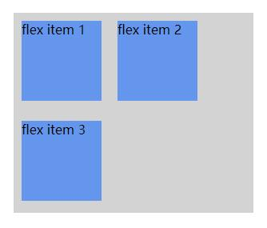
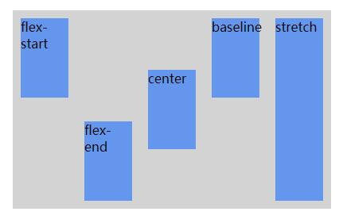

# CSS3

## 1.CSS3简介

CSS3是CSS2的升级版本，增加了很多好用的选择器以及新的样式属性

CSS3有一定的浏览器兼容问题，但其中常用的属性 兼容性较好

而且也能够通过添加浏览器前缀的方式 解决兼容性问题

- -webkit- : Chrome , Safari
- -o- : Opera
- -moz- : Firefox
- -ms- : IE

## 2.CSS3选择器

### 2.1 属性选择器

- [attribute]

```css
/* 选择所有带有target属性的 <a>元素 */
a[target] {
    background-color: yellow;
}
```

- [attribute=value]

```css
/* 选择所有使用target="_blank"的a元素 */
a[target=_blank] {
    background-color: yellow;
}
```

- [attribute~=value]

```css
/* 选择标题属性包含单词"flower"的所有元素 */
[title~=flower] {
    background-color: yellow;
}
```

- [attribute^=value]

```css
/* 设置class属性值以"test"开头的所有div元素的背景颜色 */
div[class^="test"] {
    background: #ffff00;
}
```

- [attribute$=value]

```css
/* 设置class属性值以"test"结尾的所有div元素的背景颜色 */
div[class$="test"] {
    background: #ffff00;
}
```

- [attribute*=value]

```css
/* 设置class属性值包含"test"的所有div元素的背景颜色 */
div[class*="test"] {
    background: #ffff00;
}
```

### 2.2 伪元素选择器

- :first-child

```css
/* 匹配 <p> 的父元素的第一个<p>元素 */
p:first-child {
    background-color: yellow;
}
```

- :last-child

```css
/* 指定父元素中最后一个p元素的背景色 */
p:last-child {
    background: #ff0000;
}
```

- :nth-child(n) 匹配父元素中的第n个子元素。n可以是一个数字，一个关键字，或者一个公式

```css
/* 指定每个p元素匹配父元素中的第2个子元素的背景色 */
p:nth-child(2) {
    background: #ff0000;
}
```

### 2.3 伪元素选择器

- ::selection 匹配元素中被用户选中或处于高亮状态的部分

## 3.阴影

### 3.1 box-shadow 盒子阴影

```css
box-shadow: h-shadow v-shadow blur spread color inset;

/*
    h-shadow 必需的。水平阴影的位置。允许负值
    v-shadow 必需的。垂直阴影的位置。允许负值
    blur 可选。模糊距离
    spread 可选。阴影的大小
    color 可选。阴影的颜色
    inset 可选。从外层的阴影（开始时）改变阴影内侧阴影
*/
```

### 3.2 text-shadow 文字阴影

```css
text-shadow: h-shadow v-shadow blur color;

/*
    h-shadow 必需的。水平阴影的位置。允许负值
    v-shadow 必需的。垂直阴影的位置。允许负值
    blur 可选。模糊距离
    color 可选。阴影的颜色
*/
```

## 4.box盒模型

box-sizing盒模型

- border-box 优先保证自己所占区域的大小,对内容进行压缩

    也就是说，设置了width和height，此时如果设置border和padding，不会向外撑大盒子，而是向内压缩内容大小

- content-box 保证内容大小，对盒子进行压缩

    不设置默认content-box

## 5.背景

### 5.1 background-size

属性值：

- cover 此时会保持图像的纵横比并将图像缩放成将完全覆盖背景定位区域的最小大小

- contain 此时会保持图像的纵横比并将图像缩放成将适合背景定位区域的最大大小。

- 具体的宽高

### 5.2 background-origin

设置背景图片开始的位置

border-box：从border开始

content-box：内容区域开始

padding-box：从padding开始

### 5.3 background-clip

设置背景图片裁剪的位置

border-box：从border开始裁剪

content-box：内容区域开始裁剪

padding-box：从padding开始裁剪

## 6.渐变

### 6.1 线性渐变

```css
background: linear-gradient(direction, color-stop1, color-stop2, ...);
/*
    direction 用角度值指定渐变的方向（或角度）
    color-stop1, color-stop2,... 用于指定渐变的起止颜色。
*/
```

### 6.2 径向渐变

```css
background: radial-gradient(center, shape size, start-color, ..., last-color);
```

## 7. 转换

变换的效果，让某个元素改变形状，大小和位置。

使用transform属性就可以设定转换

### 7.1 2D 转换

#### 7.1.1 translate() 方法

translate()方法，根据左(X轴)和顶部(Y轴)位置给定的参数，从当前元素位置移动。

```css
div {
    transform: translate(50px, 100px);
    -ms-transform: translate(50px, 100px);
    /* IE 9 */
    -webkit-transform: translate(50px, 100px);
    /* Safari and Chrome */
}

/* translate值（50px，100px）是从左边元素移动50个像素，并从顶部移动100像素 */
```

#### 7.1.2 rotate() 方法

rotate()方法，在一个给定度数顺时针旋转的元素。负值是允许的，这样是元素逆时针旋转

```css
div {
    transform: rotate(30deg);
    -ms-transform: rotate(30deg);
    /* IE 9 */
    -webkit-transform: rotate(30deg);
    /* Safari and Chrome */
}
```

#### 7.1.3 scale() 方法

scale()方法，该元素增加或减少的大小，取决于宽度（X轴）和高度（Y轴）的参数

```css
div {
    -ms-transform: scale(2, 3);
    /* IE 9 */
    -webkit-transform: scale(2, 3);
    /* Safari */
    transform: scale(2, 3);
    /* 标准语法 */
}
/* scale（2,3）转变宽度为原来的大小的2倍，和其原始大小3倍的高度 */
```

#### 7.1.4 skew() 方法

```transform:skew(<angle> [,<angle>]);```

包含两个参数值，分别表示X轴和Y轴倾斜的角度，如果第二个参数为空，则默认为0，参数为负表示向相反方向倾斜。

skewX(angle);表示只在X轴(水平方向)倾斜。

skewY(angle);表示只在Y轴(垂直方向)倾斜。


```css

div {
    transform: skew(30deg, 20deg);
    -ms-transform: skew(30deg, 20deg);
    /* IE 9 */
    -webkit-transform: skew(30deg, 20deg);
    /* Safari and Chrome */
}
/* skew(30deg,20deg) 元素在X轴和Y轴上倾斜20度30度 */

```

#### 7.1.5 transform-origin 属性

设置旋转元素的基点位置

```transform-origin: x-axis y-axis z-axis;```

x-axis
定义视图被置于 X 轴的何处。可能的值：
left
center
right
length
%

y-axis
定义视图被置于 Y 轴的何处。可能的值：
top
center
bottom
length
%

-axis
定义视图被置于 Z 轴的何处。可能的值：
length

### 7.2 3D 转换

#### 7.2.1 transform-style 属性

指定嵌套元素是怎样在三维空间中呈现

```transform-style: flat|preserve-3d;```

- flat 表示所有子元素在2D平面呈现。

- preserve-3d 表示所有子元素在3D空间中呈现。

#### 7.2.2 perspective 属性

呈现近大远小效果，如果不设置，没有近大远小效果(立体效果)，越近越大 到0看不见

```perspective: number|none;```

- number元素距离视图的距离，以像素计。

- none默认值。与 0 相同。不设置透视。

>一般要设置100以上的值，否则效果特别夸张！

#### 7.2.3 backface-visibility 属性

backface-visibility 属性定义当元素不面向屏幕时是否可见。

如果在旋转元素不希望看到其背面时，该属性很有用。

```backface-visibility: visible|hidden;```

- visible 背面是可见的。
- hidden 背面是不可见的。

#### 7.2.4 各种3D转换方法

- translate3d(x,y,z)	定义 3D 转化。
- translateX(x)	定义 3D 转化，仅使用用于 X 轴的值。
- translateY(y)	定义 3D 转化，仅使用用于 Y 轴的值。
- translateZ(z)	定义 3D 转化，仅使用用于 Z 轴的值。
- scale3d(x,y,z)	定义 3D 缩放转换。
- scaleX(x)	定义 3D 缩放转换，通过给定一个 X 轴的值。
- scaleY(y)	定义 3D 缩放转换，通过给定一个 Y 轴的值。
- scaleZ(z)	定义 3D 缩放转换，通过给定一个 Z 轴的值。
- rotate3d(x,y,z,angle)	定义 3D 旋转。
- rotateX(angle)	定义沿 X 轴的 3D 旋转。
- rotateY(angle)	定义沿 Y 轴的 3D 旋转。
- rotateZ(angle)	定义沿 Z 轴的 3D 旋转。

## 8.过渡

CSS3 过渡是元素从一种样式逐渐改变为另一种的效果。

要实现这一点，必须规定两项内容：
- 指定要添加效果的CSS属性
- 指定效果的持续时间。

### 8.1 transition-property属性

transition-property属性指定元素的哪些CSS属性会有过渡效果

```transition-property: none|all| property```

- none	没有属性会获得过渡效果。
- all	所有属性都将获得过渡效果。
- property	定义应用过渡效果的 CSS 属性名称列表，列表以逗号分隔。

### 8.2 transition-duration 属性

transition-duration 属性规定完成过渡效果需要花费的时间

```transition-duration: time;```

- time	规定完成过渡效果需要花费的时间（以秒或毫秒计）。 默认值是 0，意味着不会有效果。

例：```transition-duration: 5s;```

### 8.3 transition-timing-function 属性

transition-timing-function属性指定切换效果的速度。
此属性允许一个过渡效果，以改变其持续时间的速度

```transition-timing-function: linear|ease|ease-in|ease-out|ease-in-out;```

- linear	规定以相同速度开始至结束的过渡效果
- ease	规定慢速开始，然后变快，然后慢速结束的过渡效果
- ease-in	规定以慢速开始的过渡效果
- ease-out	规定以慢速结束的过渡效果
- ease-in-out	规定以慢速开始和结束的过渡效果

### 8.4 transition-delay 属性

transition-delay 属性指定何时将开始切换效果

```transition-delay: time;```

- time	指定秒或毫秒数之前要等待切换效果开始

### 8.5 transition 属性

transition属性是以上四种过渡属性的连写形式

```transition: property duration timing-function delay;```

## 9.动画

### 9.1 定义动画

动画是使元素从一种样式逐渐变化为另一种样式的效果。
您可以改变任意多的样式任意多的次数。
请用百分比来规定变化发生的时间，或用关键词 "from" 和 "to"，等同于 0% 和 100%。
0% 是动画的开始，100% 是动画的完成。

使用'@keyframe 自定义动画名称'定义动画

```css
@keyframes myfirst
{
    0%   {background: red;}
    25%  {background: yellow;}
    50%  {background: blue;}
    100% {background: green;}
}

@keyframes myfirst
{
    from {background: red;}
    to {background: yellow;}
}
```

### 9.2 使用动画

当在 @keyframes 创建完动画后，把它绑定到一个选择器，否则动画不会有任何效果。

指定至少这两个CSS3的动画属性绑定向一个选择器：

- 规定动画的名称
- 规定动画的时长

```animation: name duration timing-function delay iteration-count direction fill-mode play-state;```

- animation-name	指定要绑定到选择器的关键帧的名称
- animation-duration	动画指定需要多少秒或毫秒完成
- animation-timing-function	设置动画将如何完成一个周期
- animation-delay	设置动画在启动前的延迟间隔。
- animation-iteration-count	定义动画的播放次数。
    
    - infinite 指定动画应该播放无限次（永远）

    - n 一个数字，定义应该播放多少次动画

- animation-direction	指定是否应该轮流反向播放动画。
    - normal	默认值。动画按正常播放。
    - reverse	动画反向播放
    - alternate	动画在奇数次（1、3、5...）正向播放，在偶数次（2、4、6...）反向播放
    - alternate-reverse	动画在奇数次（1、3、5...）反向播放，在偶数次（2、4、6...）正向播放
    
- animation-fill-mode	规定当动画不播放时（当动画完成时，或当动画有一个延迟未开始播放时），要应用到元素的样式。
- animation-play-state	指定动画是否正在运行或已暂停。

## 10.弹性盒子

弹性盒子是 CSS3 的一种新的布局模式。

CSS3 弹性盒（ Flexible Box 或 flexbox），是一种当页面需要适应不同的屏幕大小以及设备类型时确保元素拥有恰当的行为的布局方式。

引入弹性盒布局模型的目的是提供一种更加有效的方式来对一个容器中的子元素进行排列、对齐和分配空白空间。

### 10.1 CSS3 弹性盒子内容

弹性盒子由弹性容器(Flex container)和弹性子元素(Flex item)组成。

弹性容器通过设置 display 属性的值为 flex 或 inline-flex将其定义为弹性容器。

弹性容器内包含了一个或多个弹性子元素

>注意： 弹性容器外及弹性子元素内是正常渲染的。弹性盒子只定义了弹性子元素如何在弹性容器内布局。
弹性子元素通常在弹性盒子内一行显示。默认情况每个容器只有一行

### 10.2 flex-direction 属性

flex-direction 指定弹性容器主轴的方向

```flex-direction: row | row-reverse | column | column-reverse```

flex-direction的值有:

- row：横向从左到右排列（左对齐），默认的排列方式。
- row-reverse：反转横向排列（右对齐，从后往前排，最后一项排在最前面。
- column：纵向排列。
- column-reverse：反转纵向排列，从后往前排，最后一项排在最上面。

### 10.3 justify-content 属性

内容对齐（justify-content）属性应用在弹性容器上，用于设定弹性子容器在弹性容器中主轴方向的对齐方式

```justify-content: flex-start | flex-end | center | space-between | space-around```

- flex-start：
弹性项目向行头紧挨着填充。这个是默认值。第一个弹性项的main-start外边距边线被放置在该行的main-start边线，而后续弹性项依次平齐摆放。

- flex-end：
弹性项目向行尾紧挨着填充。第一个弹性项的main-end外边距边线被放置在该行的main-end边线，而后续弹性项依次平齐摆放。

- center：
弹性项目居中紧挨着填充。（如果剩余的自由空间是负的，则弹性项目将在两个方向上同时溢出）。

- space-between：
弹性项目平均分布在该行上。如果剩余空间为负或者只有一个弹性项，则该值等同于flex-start。否则，第1个弹性项的外边距和行的main-start边线对齐，而最后1个弹性项的外边距和行的main-end边线对齐，然后剩余的弹性项分布在该行上，相邻项目的间隔相等。

- space-around：
弹性项目平均分布在该行上，两边留有一半的间隔空间。如果剩余空间为负或者只有一个弹性项，则该值等同于center。否则，弹性项目沿该行分布，且彼此间隔相等（比如是20px），同时首尾两边和弹性容器之间留有一半的间隔（1/2*20px=10px）。

各属性效果如下：


### 10.4 align-items 属性

align-items 设置或检索弹性盒子元素在副轴方向上的对齐方式

```align-items: flex-start | flex-end | center | baseline | stretch```

各个值解析:

- flex-start：弹性盒子元素的侧轴（纵轴）起始位置的边界紧靠住该行的侧轴起始边界。

- flex-end：弹性盒子元素的侧轴（纵轴）起始位置的边界紧靠住该行的侧轴结束边界。

- center：弹性盒子元素在该行的侧轴（纵轴）上居中放置。（如果该行的尺寸小于弹性盒子元素的尺寸，则会向两个方向溢出相同的长度）。

- baseline：如弹性盒子元素的行内轴与侧轴为同一条，则该值与'flex-start'等效。其它情况下，该值将参与基线对齐。

- stretch：如果指定侧轴大小的属性值为'auto'，则其值会使项目的边距盒的尺寸尽可能接近所在行的尺寸，但同时会遵照'min/max-width/height'属性的限制。

### 10.5 flex-wrap 属性

flex-wrap 属性用于指定弹性盒子的子元素换行方式

```flex-wrap: nowrap|wrap|wrap-reverse|initial|inherit;```

各个值解析:
- nowrap - 默认， 弹性容器为单行。该情况下弹性子项可能会溢出容器。

- wrap - 弹性容器为多行。该情况下弹性子项溢出的部分会被放置到新行，子项内部会发生断行

- wrap-reverse -反转 wrap 排列。

设置了wrap后，子元素会换行：



### 10.6 align-content 属性

align-content 属性用于修改 flex-wrap 属性的行为。类似于 align-items, 但它不是设置弹性子元素的对齐，而是设置各个行的对齐

```align-content: flex-start | flex-end | center | space-between | space-around | stretch```

- stretch - 默认。各行将会伸展以占用剩余的空间。
- flex-start - 各行向弹性盒容器的起始位置堆叠。
- flex-end - 各行向弹性盒容器的结束位置堆叠。
- center -各行向弹性盒容器的中间位置堆叠。
- space-between -各行在弹性盒容器中平均分布。
- space-around - 各行在弹性盒容器中平均分布，两端保留子元素与子元素之间间距大小的一半。

### 10.7 完美的居中

使用弹性盒子，居中变的很简单，只想要设置 margin: auto; 可以使得弹性子元素在两上轴方向上完全居中

```css
.flex-item {
    background-color: cornflowerblue;
    width: 75px;
    height: 75px;
    margin: auto;
}
```

### 10.8 align-self 属性

align-self 属性用于设置弹性元素自身在副轴方向上的对齐方式

```align-self: auto | flex-start | flex-end | center | baseline | stretch```

各个值解析:
- auto：如果'align-self'的值为'auto'，则其计算值为元素的父元素的'align-items'值，如果其没有父元素，则计算值为'stretch'。

- flex-start：弹性盒子元素的侧轴（纵轴）起始位置的边界紧靠住该行的侧轴起始边界。

- flex-end：弹性盒子元素的侧轴（纵轴）起始位置的边界紧靠住该行的侧轴结束边界。

- center：弹性盒子元素在该行的侧轴（纵轴）上居中放置。（如果该行的尺寸小于弹性盒子元素的尺寸，则会向两个方向溢出相同的长度）。

- baseline：如弹性盒子元素的行内轴与侧轴为同一条，则该值与'flex-start'等效。其它情况下，该值将参与基线对齐。

- stretch：如果指定侧轴大小的属性值为'auto'，则其值会使项目的边距盒的尺寸尽可能接近所在行的尺寸，但同时会遵照'min/max-width/height'属性的限制。

    

### 10.9 flex 属性

flex 属性用于指定弹性子元素如何分配空间

```flex: auto | initial | none | inherit |  [ flex-grow ] || [ flex-shrink ] || [ flex-basis ]```

各个值解析:

- auto: 计算值为 1 1 auto
- initial: 计算值为 0 1 auto
- none：计算值为 0 0 auto
- inherit：从父元素继承
- [ flex-grow ]：定义弹性盒子元素的扩展比率。
- [ flex-shrink ]：定义弹性盒子元素的收缩比率。
- [ flex-basis ]：定义弹性盒子元素的默认基准值。

以下实例中，第一个弹性子元素占用了 2/4 的空间，其他两个各占 1/4 的空间:

```css
.item1 {
    -webkit-flex: 2;
    flex: 2;
}

.item2 {
    -webkit-flex: 1;
    flex: 1;
}

.item3 {
    -webkit-flex: 1;
    flex: 1;
}
```