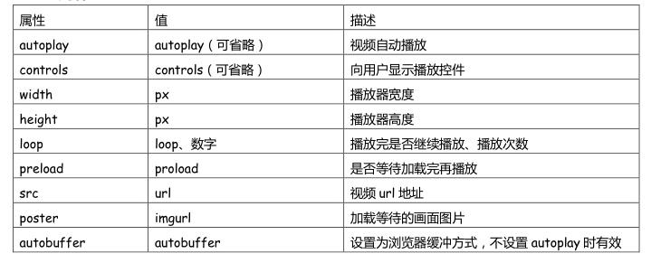

# HTML5

## 1.HTML5新增和重新定义的标签

### 1.1 结构标签

块级元素，有语义的 div

    <article> 定义一篇文章，强调独立性
    <header> 定义一个页面或一个区域的头部
    <nav> 定义导航链接
    <section> 定义一个区域，例如将一块内容分成几段
    <aside> 定义页面内容部分的侧边栏
    <hgroup> 定义文件中一个区块的相关信息，里面放 h 系列的标签，最好 h3
    <figure> 定义一组媒体内容以及它们的标题
    <figcaption> 定义 figure 元素的标题
    <footer> 定义一个页面或一个区域的底部
    <dialog> 定义一个对话框类似微信

### 1.1.1 html5新语义标签的兼容问题

html5新语义标签在版本低于ie9的 ie中 无法正常显示

在不支持HTML5新标签的浏览器里，会将这些新的标签解析成行内元素(inline)对待，所以我们只需要将其转换成块元素(block)即可使用

解决办法：

1. 自己写js代码创建标签

    ```html
    <!--[if lt IE 9]>//   快捷键cc:ie6  +  tab   小于ie9 (lt小于，lte小于等于，gt大于，gte大于等于)
    <script type="text/javascript">
    alert("我执行了");
    window.onload = function(){
        var createHeader = document.createElement("header");
        createHeader.style.display = 'block';
        document.body.appendChild(createHeader);
    }
    </script>
    <![endif]-->
    ```

使用注释判断语句判断IE版本决定代码的运行与否

2. 导入html5shiv.js 框架

    ```html
    <!--[if lt IE 9]>
    <script type="text/javascript" src='js/html5shiv.min.js'></script>
    <![endif]-->
    ```

### 1.2 多媒体标签

    <video> 定义一个视频
    <audio> 定义音频内容
    <source> 定义媒体资源
    <canvas> 定义图片
    <embed> 定义外部的可交互的内容或插件 比如 flash

#### 1.2.1 audio和video属性

- autoplay 就绪后马上播放

- controls 向用户显示播放控件

- loop 是否循环播放

- muted 静音

- preload 当网页加载时,媒体文件是否默认被加载以及如何被加载

    auto、metadata、none

- src 规定音频文件的 URL

- poster 视频专属，规定视频正在下载时显示的图像，直到用户点击播放按钮

### 1.3 Web 应用标签

    <command> menu 标记定义一个命令按钮
    <meter> 实时状态显示：气压、气温（ 状态标签）
    属性：min、max、value、low、high value 在 low 和 high 中间正常，之外会变色警告
    <progress> 任务过程：安装、加载（状态标签）进度条
    <datalist> 为 input 标记定义一个下拉列表，配合 option
    <details> 标记定义一个元素的详细内容，配合 dt、dd，有下拉框

### 1.4 其它标签

    <keygen> 定义表单里一个生成的键值（加密信息传送）
    <mark> 定义有标记的文本（黄色选中状态）
    <output> 定义一些输出类型，计算表单结果配合 oninput 事件

## 2. HTML5 视频、音频播放事件属性与 API 控件

```html
<video src = "movie.mp4" controls = "controls"><video>
或者
<video controls = "controls">
    <source src = "movie.mp4">
<video>
```



### 2.1 HTML5 视频 API 控件

- 载入视频：load()
- 播放视频：play()
- 暂停:pause()
- 快进 10 秒：currentTime +=10
- 播放速度增加 0.1：playbackRate += 0.1
- 音量增加：volume += 0.1
- 静音：muted = true
- duration 媒体长度
- timeupdate 媒体当前位置

## 3.HTML5表单新增相关

### 3.1 input 标签的新 type 属性

- color：定义拾色器

- date：定义 date 控件（包括年、月、日，不包括时间）

- datetime：定义 date 和 time 控件（包括年、月、日、时、分、秒、几分之一秒，基于 UTC 时区）。

- datetime-local：定义 date 和 time 控件（包括年、月、日、时、分、秒、几分之一秒，不带时区）

- month：定义 month 和 year 控件（不带时区）

- time：定义用于输入时间的控件（不带时区）

- week：定义 week 和 year 控件（不带时区）

- email：定义用于 e-mail 地址的字段

- number：定义用于输入数字的字段

- range：定义用于精确值不重要的输入数字的控件（比如 slider 控件）

- search：定义用于输入搜索字符串的文本字段

- tel：定义用于输入电话号码的字段

- url：定义用于输入 URL 的字段

以上控件有一部分在桌面端看不出区别，跟type=text类似，
但是在移动端，会弹出不同的虚拟键盘，所以不建议在PC端过多使用

### 3.2 新表单元素

#### 3.2.1 datalist

datalist 标签规定了 input 元素可能的选项列表。

datalist 标签被用来在为 input 元素提供"自动完成"的特性。用户能看到一个下拉列表，里边的选项是预先定义好的，将作为用户的输入数据。

请使用 input 元素的 list 属性来绑定 datalist 元素

```html
<input list="browsers">

<datalist id="browsers">
    <option value="Internet Explorer"></option>
    <option value="Firefox"></option>
    <option value="Chrome"></option>
    <option value="Opera"></option>
    <option value="Safari"></option>
</datalist>
```

#### 3.2.1 keygen

keygen 标签规定用于表单的密钥对生成器字段。
当提交表单时，私钥存储在本地，公钥发送到服务器。

```html
<form action="demo_keygen.asp" method="get">
    用户名:
    <input type="text" name="usr_name"> 加密:
    <keygen name="security">
    <input type="submit">
</form>
```

#### 3.2.2 output

output 标签作为计算结果输出显示(比如执行脚本的输出)

### 3.3 新表单属性

#### 3.3.1 autocomplete

autocomplete 属性规定 form 或 input 域应该拥有自动完成功能。

当用户在自动完成域中开始输入时，浏览器应该在该域中显示填写的选项。

提示: autocomplete 属性有可能在 form元素中是开启的，而在input元素中是关闭的。

>注意: autocomplete 适用于 form 标签，以及以下类型的 input 标签：text, search, url, telephone, email, password, datepickers, range 以及 color。

```html
<form action="#" autocomplete="on">
    First name:
    <input type="text" name="fname">
    <br> Last name:
    <input type="text" name="lname">
    <br> E-mail:
    <input type="email" name="email" autocomplete="off">
    <br>
    <input type="submit">
</form>
```

#### 3.3.2 autofocus

autofocus 属性是一个 boolean 属性.

autofocus 属性规定在页面加载时，域自动地获得焦点。

#### 3.3.3 multiple

multiple 属性是一个 boolean 属性.

multiple 属性规定 input 元素中可选择多个值。例如上传文件时可以多选

>注意: multiple 属性适用于以下类型的 input 标签：email 和 file

#### 3.3.4 placeholder

placeholder 属性提供一种提示（hint），描述输入域所期待的值。

简短的提示在用户输入值前会显示在输入域上。

>注意: placeholder 属性适用于以下类型的 input 标签：text, search, url, telephone, email 以及 password。

#### 3.3.5 required

required 属性是一个 boolean 属性.

required 属性规定必须在提交之前填写输入域（不能为空）。

>注意:required 属性适用于以下类型的 input 标签：text, search, url, telephone, email, password, date pickers, number, checkbox, radio 以及 file

## 4.HTML5新JS API

### 4.1 获取元素的新方法

querySelector和querySelectorAll

语法：

```js
document.querySelector('CSS selectors');
document.querySelectorAll('CSS selectors');
```

参数：

一个string类型的CSS选择器

返回值：

querySelector返回获取到的第一个元素

querySelectorAll返回获取到的元素伪数组

### 4.2 classList

classList 属性返回元素的类名，作为 DOMTokenList 对象

- 增加：div.classList.add("orange")

- 删除：div.classList.remove("orange")

- 修改：div.classList.toggle("orange")

- 查询：div.classList.contains("orange")

### 4.3 dataset 自定义属性

html5为了规范自定义属性的写法,新增了一个 data-的属性

data-* 属性用于存储私有页面后应用的自定义数据。

data-* 属性可以在所有的 HTML 元素中嵌入数据。
自定义的数据可以让页面拥有更好的交互体验（不需要使用 Ajax 或去服务端查询数据）。

data-* 属性由以下两部分组成：
属性名不要包含大写字母，在 data- 后必须至少有一个字符。
该属性可以是任何字符串

注意： 自定义属性前缀 "data-" 会被客户端忽略。

```html
<div data-age='18' data-skill='eatFood' data-habbit = 'tableTannis' data-food-vegetable='西兰花' data-foodMeat='牛肉'></div>
```

所有通过date-添加的属性都会保存在dataset中

可以通过'dataset.属性名'取出设置的属性

获取两个单词第二个单词用大写

```js
document.querySelector('div').dataset.foodVegtable
```

### 4.4 拖放

1. 设置元素为可拖放

    首先，为了使元素可拖动，把 draggable 属性设置为 true

    ```html
    
    ```

2. 拖动什么 - ondragstart

    规定当元素被拖动时，会发生什么

    ```js
    box.ondragstart = function (e) {
        // 拖动开始时事件
    }
    ```

3. 放到何处 - ondragover

    ondragover 事件规定在何处放置被拖动的数据。

    默认地，无法将数据/元素放置到其他元素中。如果需要设置允许放置，我们必须阻止对元素的默认处理方式。

    这要通过调用 ondragover 事件的 event.preventDefault() 方法

    ```js
    block.ondragover = function (e) {
        e.preventDefault();
    }
    ```

4. 进行放置 - ondrop

    规定当放置被拖数据时发生的事件

    ```js
    block.ondrop = function (e) {
        e.target.appendChild(box);
    }
    ```

ondragstart发生在被拖动元素上，ondragover和ondrop发生在拖动放置的元素上

### 4.4 本地存储

早些时候,本地存储使用的是 cookie。

但是 Web 存储需要更加的安全与快速. 这些数据不会被保存在服务器上，但是这些数据只用于用户请求网站数据上.它也可以存储大量的数据，而不影响网站的性能.

数据以 键/值 对存在, web 网页的数据只允许该网页访问使用。

- 容量

    cookie 5KB

    sessionStorage 5MB

    localStorage 20MB

- 持续时间

    cookie 不设置保存时间关闭浏览器就消失

    sessionStorage 关闭浏览器就消失

    localStorage 一直存在直到手动清除

- 存储内容

    三者都是保存着字符串

sessionStorage和localStorage的操作

- setItem(key, value) 设置存储内容

- getItem(key) 读取存储内容

- removeItem(key) 删除键值为key的存储内容

- clear() 清空所有存储内容

好处：

使用本地存储数据可以减少请求次数，提高加载速度

### 4.5 Geolocation 地理定位

通过IP地址、三维坐标、GPS、Wi-Fi、手机信息等多种方式获取地址信息，浏览器会自动以最优方式去获取用户地理信息。

```js
document.querySelector('input[value=获取位置信息]').onclick = function () {
    window.navigator.geolocation.getCurrentPosition(function (position) {
        console.log(position);
        console.log('位置获取成功');
        console.log('经度:' + position.coords.longitude);
        console.log('纬度:' + position.coords.latitude);
    })
}
```

由于该API使用的是谷歌地图的接口，国内最好使用高德地图、百度地图的API