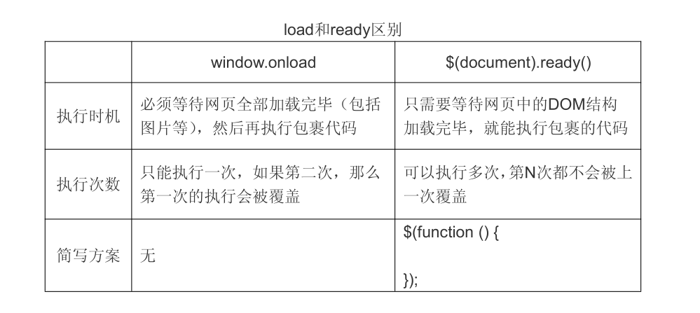

# 基础核心

## 1.代码风格

在jQuery程序中，不管是页面元素的选择、内置的功能函数，都是美元符号“$”来起
始的。而这个“$”就是jQuery当中最重要且独有的对象：jQuery对象，所以我们在页面元
素选择或执行功能函数的时候可以这么写：

```js
$(function () {}); //执行一个匿名函数
$('#box'); //进行执行的ID元素选择
$('#box').css('color', 'red'); //执行功能函数
```

由于$本身就是jQuery对象的缩写形式,所以上面代码的'$'可以被'jQuery'取代

链式编程

```js
$('#box').css('color', 'red').css('font-size', '50px'); //每次调用一个方法后会返回jQuery对象，所以可以继续调用其它jQuery对象
```

## 2.加载模式

jQuery库文件是在body元素之前加载的，我们必须等待所
有的DOM元素加载后，延迟支持DOM操作，否则就无法获取到

在延迟等待加载，JavaScript提供了一个事件为load，方法如下：

```js
window.onload = function () {}; //JavaScript等待加载

$(document).ready(function () {}); //jQuery等待加载
```



在实际应用中，我们都很少直接去使用window.onload，因为他需要等待图片之类的大
型元素加载完毕后才能执行JS代码。所以，最头疼的就是网速较慢的情况下，页面已经全
面展开，图片还在缓慢加载，这时页面上任何的JS交互功能全部处在假死状态。并且只能
执行单次在多次开发和团队开发中会带来困难

## 3.对象互换

只要使用了jQeury包裹后，最终返回的都是 jQuery 对象，可以连缀处理。但有时，我们也需要返回原生的 DOM 对象

jQuery 想要达到获取原生的 DOM 对象，可以这么处理

```js
$('#box').get(0)
```

## 4.多个库之间的冲突

当一个项目中引入多个第三方库的时候，由于没有命名空间的约束（命名空间就好比同
一个目录下的文件夹一样，名字相同就会产生冲突），库与库之间发生冲突在所难免

如果将 jQuery 库在其它库之后引入，那么“$”的所有权就归 jQuery 库所有，而其它用了$符的库将会冲突而失去作用。这里，jQuery 提供了一个方法：

```js
jQuery.noConflict(); //将$符所有权剔除
var $$ = jQuery;
$(function () {
    alert($('#box').ge(0));
    alert($$('#box').width());
});
```

这样其它用了$符的库可以继续正常使用，$$变成了jQuery对象的另一种表示形式

