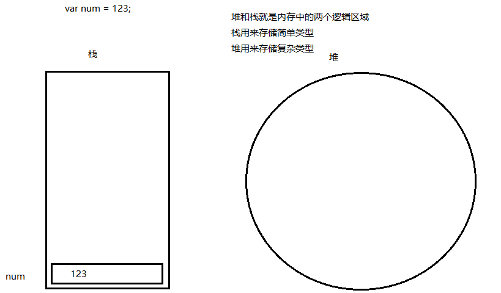
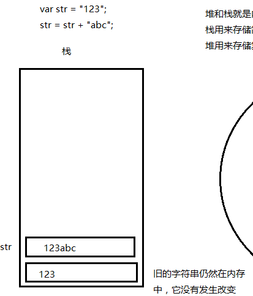

# 1.基本介绍

## 1.1 输出语句

JS常用输出语句如下：

~~~js
alert("弹出框内容");
console.log("控制台内容");
document.write("在页面输出内容");
~~~

## 1.2 代码注释

JS的代码注释有如下几种：

- //单行注释
- /\* 多行注释 \*/
- /** + 回车 用于函数的说明

>注意：书写多行注释的时候注意不要发生嵌套

## 1.3 书写位置

可以写在HTML页面内的任意位置或者从外部引用

## 1.4 标签属性

- type:类型
- src:外部文件地址
- async:异步加载
- defer:延迟加载

# 2.变量

## 2.1 变量的命名规范

规则(必须遵守)：

- 区分大小写
- 不能是关键字和保留字
- 由字母、数字、下划线、$ 组成且开头不能是数字

规范(建议遵守)：

- 变量的名称要有实际意义
- 规则中所说的字母包括ASCII和Unicode字母字符，如汉字，但不推荐使用汉字
- 变量的命名遵守驼峰命名法，首字母小写,第二个单词的首字母大写 例如：userName

## 2.2 变量的声明赋值

书写格式

~~~javascript
var 变量名 = 值
~~~



## 2.3 弱类型

是弱类型的语言，即声明不同数据类型的变量使用同一个关键字**var**，变量的数据类型由其赋值决定

# 3.数据类型

## 3.1 数据类型分类

>注意：声明的时候不用考虑类型，但是处理和计算的时候要考虑类型

基本数据类型

- number数值型
- string字符串型
- boolean布尔型
- undefined 未定义
- null空

复杂数据类型

- object对象

使用typeof关键字可以查看变量的数据类型

```js
typeof undefined /* "undefined" */

typeof null /* "object" */

typeof 123 /* "number" */

typeof '123' /* "string" */

typeof true /* "boolean" */
```

注意：

1.除函数以外，其它任何对象型数据使用typeof后返回的都是object

2.typeof返回的是字符串

## 3.2 数值类型

字面量

~~~javascript
var num = 数字;
~~~

需要注意的地方：
>计算浮点数时会丢失精度
我们通常用整数的计算来表示浮点数的计算
不要以两个浮点数是否相等作为条件判断的依据（判断范围还是可以的）

计算浮点数的过程：

1. 根据计算的精度将所有参与运算的浮点数乘以10的n次方(如：保留两位小数即乘以10的2次方)
2. 将进行精度计算后的所有浮点数强转成整数(使用parseInt()或Math.floor())
3. 进行计算，并将最终的计算结果除以10的n次方(n等于最初做精度乘法的时n的值)

特殊的NaN(Not a Number)

1. NaN是数值类型
2. NaN不等于自身

使用isNaN()函数判断是否为数值

>注意：使用isNaN()时，会先试图将传入的参数转换成数值型数据，如果转换成功则返回false，如果转换失败返回true

## 3.3 字符串类型

字面量

~~~javascript
var str = “字符串”;
~~~

获取字符串长度

~~~javascript
str.length
~~~

转义符

- \n 换行
- \'单引号
- \"双引号
- \\\斜杠

字符串的不可变性



## 3.4 布尔类型
所有类型的值都可以转化成布尔值

会转化成false的值有： 空字符串("") 数值零(0) NaN undefined null

>undefined表示声明但未赋值的变量

# 4.类型转换

## 4.1 转换成字符串

将任意类型转化为字符串

~~~javascript
String(值)
~~~

大部分类型都有toString方法

~~~javascript
值.toString()
~~~

小技巧

~~~javascript
值+ ""
~~~

## 4.2 转换成数值

将任意类型转化为数值型

~~~javascript
Number(值)
~~~

将字符串转化为数值

~~~javascript
parseInt("字符串");
parseFloat("字符串");
+"数值字符串";
/* 其中parseInt可以将表示十六进制或八进制的字符串数字
转换成十进制整数，字符串以0x开头表示十六进制数，以0开头表示八进制数 */
~~~

小技巧

~~~javascript
值 - 0
~~~

## 4.3 转换成布尔值

将任意类型转化为布尔值

~~~javascript
Boolean(值)
~~~

条件判断中会自动转换

~~~javascript
if(值)
~~~

小技巧

~~~javascript
!!值
~~~