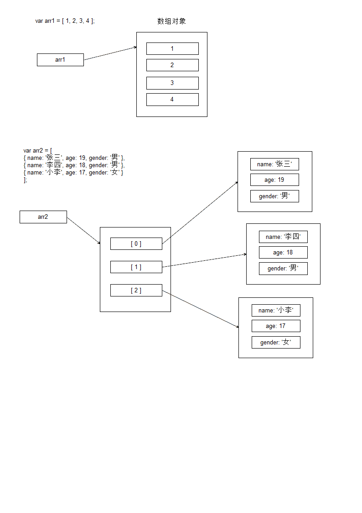
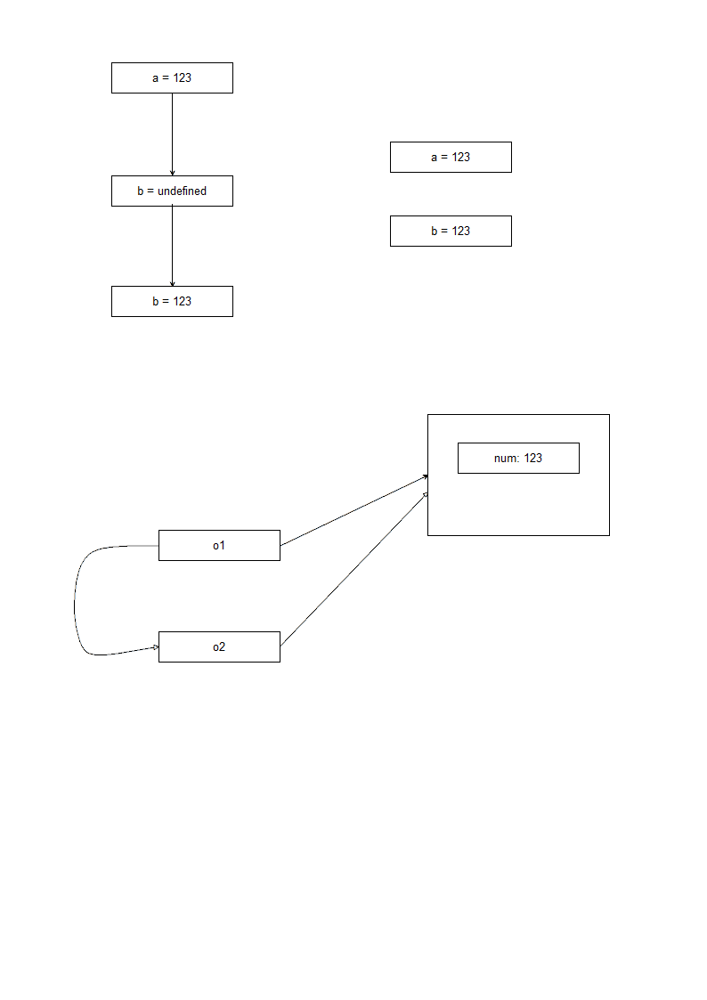

# 对象进阶

## 1.面向对象的基本概念

JavaScript 是一个基于对象的多范式的编程语言

多范式: 编程风格

- 面向过程的方式编程

- 面向对象的方式编程

- 函数式 ...

面向对象是面向过程的封装

### 1.1 万物皆对象

在实际开发中, 对象是一个抽象的概念, 可以将其简单的理解为: 数据集或功能集

- 数据集: 很多数据打包到一起.如 ```{ name: '张三', age: 19, gender: '男' }```

- 功能集(函数集, 方法集)

在 JavaScript 中, 所谓的对象就是 键值对的 集合

### 1.2 面向对象的三大特性

封装、继承、多态

### 1.3 JS封装功能集

一般我们都会将一些特定的功能封装成函数

自己定义函数越多, 那么开发的时候就会越方便

但是也有隐患, 自己定义的越多, 那么与引入的框架出现冲突的几率也就最大

一旦出现某个名字冲突了, 那么就会造成框架中某些功能无法使用

解决方案：

定义一个对象, 然后所有的函数, 变成这个对象的方法即可

```js
//定义
var fnCollect = {
    fn1:(){...},
    fn2:(){...},
    ...
}

//调用
fnCollect.fn1();
fnCollect.fn2();
...
```

## 2.JS的数据类型

### 2.1 数据类型

- 基本类型( 值类型 ): 数字 number, 字符串 string, 布尔 boolean
- 复合类型( 引用类型 ): 对象( 数组, 时间类型, 函数类型, 正则表达式, ... )
- 空类型: Null, Undefined

### 2.2 复合类型的存储方式

```js
var p = { name: 'itcast' }

/* 复合类型的对象是一个单独的内存区域, 对象有什么属性, 那么内存区域中就有什么数据.*/
/* 变量 p 只存储该对象的 '地址'. 所以 p 不是真正存储数据的区域.  */
```



### 2.3 值类型与引用类型的存储特征

值类型的数据, 只需要开辟一段内存存储数据即可

```js
var a = 123;
var b = 'abc';
var c = true;
```

对象类型( 引用类型 ). 对象才是真正的数据, 需要占据单独的内存.

而变量名只是存储着对象的内存地址( 引用 ).

即创建一个对象并赋值, 实际上需要两块内存空间. 一个存储数据( 对象 ),另一个存储变量以引用对象.

```js
var o = { name: '张三', age: 19, gender: '男' };
```

### 2.4 值类型与引用类型的赋值与传参的特性

赋值: 将原变量中的数据拷贝一份, 然后存储到给定变量中

- 值类型

```js
var a = 123; // 有一个盒子, 叫 a, 里面存储着数字 123
var b; // 又有一个盒子, 叫 b, 里面什么都没存( undefined )
b = a; // 将 a 中存储的东西复制一份, 然后赋值给 b. 即存储在 b 中
```

- 引用类型

```js
var o1 = { num: 123 };
var o2;
// 赋值
o2 = o1; // 将 o1 中存储的内容 拷贝一份 存储到 o2 中
// o1 中存储的是引用, 或 '地址'
```

o1 和 o2 虽然是不相同的两个变量, 即两个独立的盒子. 但是由于存储的地址相同.

在访问数据的时候, o1 与 o2 也是访问同一个数据, o1 将数据修改了, o2 再读取,读取的就是修改后的数据



- 函数参数传递

函数要调用, 一般会给函数传递参数

在调用函数的时候, 回将参数中表示的数据拷贝一份, 然后给参数赋值

```js
function foo( num ) {}

// 调用
var a = 123;
foo( a );
// 调用函数就是要执行函数
// 将 a 中存储的数据 拷贝一份
// 进入 函数 foo
// 给参数赋值, 相当于 num = a
// 进入函数体, 开始执行函数
```

如果给函数传入的是一个对象，这样的传参是引用传递

```js
var obj = {
    a: 1,
    b: 2
};
function fn(o) {
    o.a = 3;
    o.b = 4;
}
fn(obj);
console.log(obj); //{a:3,b:4}
```

## 3.工厂方法创建对象

```js
function createPerson( name, age, gender ) {
    var p = {};
    p.name = name;
    p.age = age;
    p.gender = gender;
    return p;
}
var p1 = createPerson( 'jim', 19, '男' );
var p2 = createPerson( 'lily', 18, '女' );
```

这个( 这种类型 )的函数就是用来创建对象的, 即生产对象. 常常将这类函数称为 '工厂函数'

## 4.构造方法创建对象

- 构造器中不需要 return 语句. 一般也可以不写
- 调用构造器的时候, 使用 new 运算符引导
- 在构造器中 this 表示当前对象. 给对象提供成员使用 this.xxx 的 方式

```js
function Person( name, age, gender ) {
    this.name = name;
    this.age = age;
    this.gender = gender;
}
// 调用构造器创建对象
var p = new Person( '李磊', 19, '男' );
```

构造器创建对象的本质: 还是使用对象的动态特性

- 首先执行 new 运算符. 即创建对象. 可以简单看做为 {} 的简写

    ```var p = new ... '相当于'  var p = {}```
- 调用构造器. 并隐含一个参数, 即刚刚创建的对象.
- 在构造器中使用 this 引用刚刚创建出来的对象.
- 构造器结束是 默认返回 this

## 5.异常与捕获

异常 简单的说, 就是代码在执行过程中出现的错误. 并不是代码的语法错误.

一旦出现异常, 其后的代码, 不再执行

try-catch-finally 语法

```js
try {
    //可能会出异常的代码
} catch ( e ) {
    //出现异常捕获后执行的代码
} finally {
    //无论出不出异常都会执行的代码
}
```