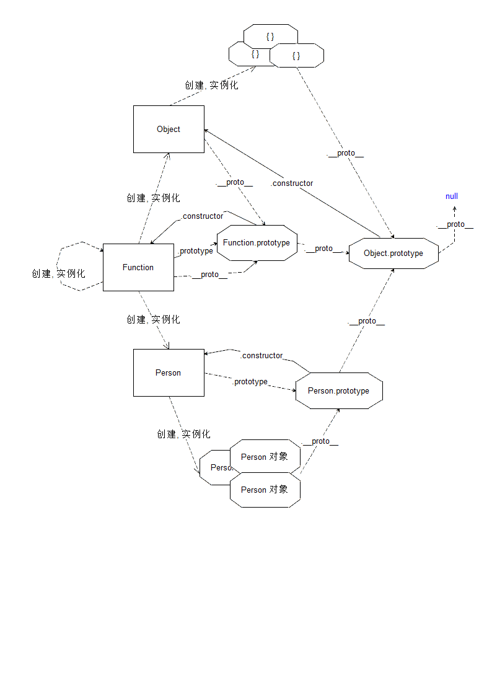

# 对象高级

## 1.对象的原型

### 1.1 为什么需要原型

构造器创建对象的时候, 实际上会有成员重复

如果使用 构造器 ```this.方法名 = function(){}``` 方式创建对象. 那么每一个对象对应的方法就会重复

解决办法就是让这个方法( 函数 )共享

- 将函数写到外面, 那么 Person 在初始化对象的时候就不会再创建一个函数了，只需要将 外面的函数引用 交给对象即可

    ```js
    //外部定义函数
    var sayHello = function () {
        console.log( '你好, 我是 ' + this.name;
    };
    //构造方法中定义方法时引入
    function Person ( name ) {
        this.name = name;
        this.sayHello = sayHello;
    }
    var p1 = new Person( '李雷' );
    var p2 = new Person( '韩梅梅' );
    p1.sayHello();
    p2.sayHello();
    ```
    缺点：一个对象可能有 n 多方法. 如果将所有的东西 都放到外面, 与其他库冲突的几率就会变大，所以不宜采取该方法

- js 原生就支持解决该问题的办法

    每一个函数都有 一个属性 prototype

    该属性指向一对象. 每一个函数的该对象都是存在

    (重点) 每一个由该函数作为构造器创建的对象, 都会默认连接到该对象上.
    如果访问对象的方法, 而对象中没有定义, 就会在这个 构造函数.prototype
    表示的对象中去找

    ```js
    function Person ( name ) {
        this.name = name;
    }
    Person.prototype.sayHello = function (){
        console.log( '你好, 我是 ' + this.name;
    };
    Person.prototype.walk = function () {
        console.log( this.name + ' 走了' );
    };
    var p1 = new Person( '李雷' );
    var p2 = new Person( '韩梅梅' );
    p1.sayHello();
    p2.sayHello();
    ```

### 1.2 使用原型

针对构造函数而言, 原型就是 构造函数的 prototype 属性, 常常将其称为 原型属性

针对实例对象而言, 原型就是 实例对象的 原型对象

一般如何使用原型对象:

- 将共享的方法放到原型中, 而独有数据与行为放在当前对象里

- 直接给原型对象添加公用属性

- 直接替换原型对象(注意: 手动的添加 constructor 属性, 表示对应的构造函数)

```js
function Person ( name, age, gender ) {
    this.name = name;
    this.age = age;
    this.gender = gender;
}
Person.prototype = {
    constructor:Person,

    say: function () {},

    eat: function () {},

    run: function () {}
};
```

### 1.3 \_\_proto\_\_

使用构造函数, 就使用 prototype 属性访问原型

使用实例对象, 就使用 非标准的 \_\_proto\_\_ 属性访问原型

### 1.4 继承

什么是继承：

    自己没有, 别人有, 拿过来自己用, 就好像自己的一样

原型与实例对象：

    在 js 中, 方法定义在原型对象中, 而属性定义在实例对象中

    调用方法的时候, 实例对象本身是没有该成员的, 但是依旧可以调用该方法, 好像这个方法就是该实例对象的一样.

    因此, 我们称该实例对象继承自 原型对象

任何一个实例, 都是继承自其原型对象的. 即原型式继承

### 1.5 属性访问原则( 重点 )

    1) 对象在调用方法或访问属性的时候, 首先在当前对象中查询. 如果有该成员使用并停止查找.

    2) 如果没有该成员就在其原型对象中查找. 如果有该成员即使用, 并停止查找.

    3) 如果还没有就到 该对象的 原型对象 的 原型对象中查找.

    4) 最后会查到 Object.prototype 上. 如果还没有即 返回 undefined.

给当前对象的原型提供的属性赋值, 实际上是给当前对象添加了该属性的新成员，并不会修改运行对象中的成员

### 1.6 混入

```js
    var o = {
        extend: function (obj) {
            // 将 obj 中的成员 加到 当前对象 this 上
            console.log(arguments)
            console.log(this)
            for (var i = 0; i < arguments.length; i++) {
                for (var k in arguments[i]) {
                    this[k] = arguments[i][k];
                }
            }
        }
    };
    o.extend({
        name: '李四'
    }, {
        age: 19,
        gender: '男'
    }, {
        sayHello: function () {
            console.log('Hello JS')
        }
    });
    console.log(o);
```

### 1.7 原型式继承

```js
function Person ( name, age, gender ) {
    this.name = name;
    this.age = age;
    this.gender = gender;
}
// 在原型上定义要被继承的方法
Person.prototype = {
    constructor:Person,

    say: function () {},

    eat: function () {},

    run: function () {}
};
```

### 1.8 混合式继承

```js
    function Person() {}

    var p = new Person();

    // 在原型上定义混入式方法
    Person.prototype.extend = function () {
        for (var i = 0; i < arguments.length; i++) {
            for (var k in arguments[i]) {
                this[k] = arguments[i][k];
            }
        }
    }

    // 继承
    Person.prototype.extend({
        sayHello: function () {
            console.log('你好, 我是新加的')
        },
        walk: function () {},
        eat: function () {}
    });

    console.log(Person.prototype);
    p.sayHello();
```

### 1.9 Object.create实现继承

```js
var o = { name: '张三', age: 20, gender: '男' };
var obj = Object.create( o );
// o.__proto__=== obj;
// Object.create(arg)，其参数是一个对象
//返回的对象满足: 该对象的原型对象 就是 参数中的 对象
```

## 2.对象的原型链

凡是对象都有原型

例如构造函数 Person 创建的实例对象 p 有原型 Person.prototype( p.\_\_proto\_\_ )

Person.prototype 是对象，它也是有原型的

问题： 原型既然是对象, 那么如何是个头？

结论：

1. Person.prototype 是 实例 p 的原型对象, 使用 \_\_proto\_\_ 可以访问对象的原型对象

2. Person.prototype 的 原型对象是 Person.prototype.\_\_proto\_\_

3. Person.prototype.\_\_proto\_\_ 里的 constructor 是 Object.，所以Person.prototype.\_\_proto\_\_ 就是 Object.prototype

4. Object.prototype.\_\_proto\_\_ 是 null. 因此表明 Object.prototype 就是顶级


链式

p --> Person.prototype( p.\_\_proto\_\_ ) --> Object.prototype --> null

系统内置的原型链

数组：[] --> Array.prototype --> Object.prototype --> null

正则：/./ --> RegExp.prototype --> Object.prototype --> null

对象：{} --> Object.prototype --> null

等等.....

## 3.动态函数 Function

动态函数就是在运行的过程中, 将一段字符串作为代码运行

由于字符串可以随意的拼接. 因此得到动态的执行

语法：

```js
    var fn = new Function(arg0, arg1, ..., argN, body);
    /* Function 的所有的参数, 除了最后一个以外, 都是生成的函数的参数 最后一个参数是 函数体
    所有的参数都是字符串*/
    var fn3 = new Function('min', 'max',
        'var sum = 0;' +
        'for ( var i = min; i <= max; i++ ) {' +
        'sum += i;' +
        '}' +
        'return sum;'
    );
```

## 4.函数的相关参数

1. arguments

    凡是函数调用, 都会默认含有一个 arguments 对象. 可以将其看做为 "数组". 里面存储着调用时传入的所有参数. 可以使用数组的索引访问这些参数.

    例如: 写一个函数, 在参数中写任意个参数, 最后求其和

    ```js
    function sum() {
        // 所有的参数都会存储到 arguments 中
        var sum = 0;
        for (var i = 0; i < arguments.length; i++) {
            sum += arguments[i];
        }
        return sum;
    }
    ```

2. length

    即函数的 length 属性. 表示 定义函数时, 参数的个数

    如果定义函数的时候, 定义了参数. 但是调用的时候又没有传递该参数. 那么该参数在函数内就是 undefined

    ```js
    function fn(a,b,c){}
    fn.length //3
    ```

3. name

    代表函数的函数名

    ```js
    function fn(a,b,c){}
    fn.name //"fn"
    ```

## 5.函数的引用 callee 与 caller

js 中函数也是一个对象

callee 在函数的内部, 它表示 当前函数 的引用

```js
    function foo() {
        console.log(arguments.callee);
    }

    foo();
    //会打印整个函数体
```

caller 就是在被调用函数中, 获得调用函数的引用

```js
    function f2() {
        console.log(f2.caller);
    }

    function myfn() {
        f2();
    }

    myfn();
    //会打印myfn的函数体
```

## 6.eval

eval 函数与 Function 功能类似. eval 可以直接将字符串作为代码来执行

```js
eval( 'alert( "执行 eval "); ' );
```

eval 就在执行函数的当前作用域
在 eval 函数中, 使用字符串声明的变量, 在 eval 函数外面可以立即使用

即 eval 函数的执行作用域与当前环境作用域一致.

## 7.instanceof

判断 构造函数的 原型属性 是否在对象的原型链上

```js
    function Person() {}

    Person.prototype = {
        name: 'aaa'
    };

    console.log(p.name); //aaa

    var p = new Person();

    console.log(p instanceof Person); //true
```

## 8.完整的原型链结构



## 9.原型链继承优化

过多的依赖原型链继承, 会损耗 性能

如果必须使用原型链继承, 最好提供一些快速访问的方法

```js
    var o = {
        method: function () {
            console.log('我是一个非常顶级的方法');
        }
    };

    function Person() {}
    Person.prototype = o;

    function Student() {
        // 将当前构造函数的method方法指向原型上的method方法
        this.method = Person.prototype.method;

    }

    Student.prototype = new Person();

    var s = new Student();

    s.method = s.__proto__.__proto__.method;

    s.method();
```

## 10. Object.prototype 的成员

- constructor 原型对应的构造函数

- hasOwnProperty 检测对象在排除原型链的情况下是否具有某个属性

    ```js
    var obj = {
        x: 1
    }
    obj.hasOwnProperty('x') //返回 true
    obj.hasOwnProperty('toString') //返回 false， 因为尽管具有obj.toString， 但是这个toString是从原型链上来的。
    ```

- propertyIsEnumerable 检测属性是否可用 for...in 枚举

- isPrototypeOf 判断要检查其原型链的对象是否存在于指定对象实例中

## 11.getter 与 setter 的语法糖

```js
    var o = (function () {
        var num = 123;
        return {
            get num: function () {
                return num;
            },
            set num: function (v) {
                num = v;
            }
        };
    })();

    o.num //获取值

    o.num = 33; //设置值

    //可以方便地对函数的私有变量进行读写操作
```