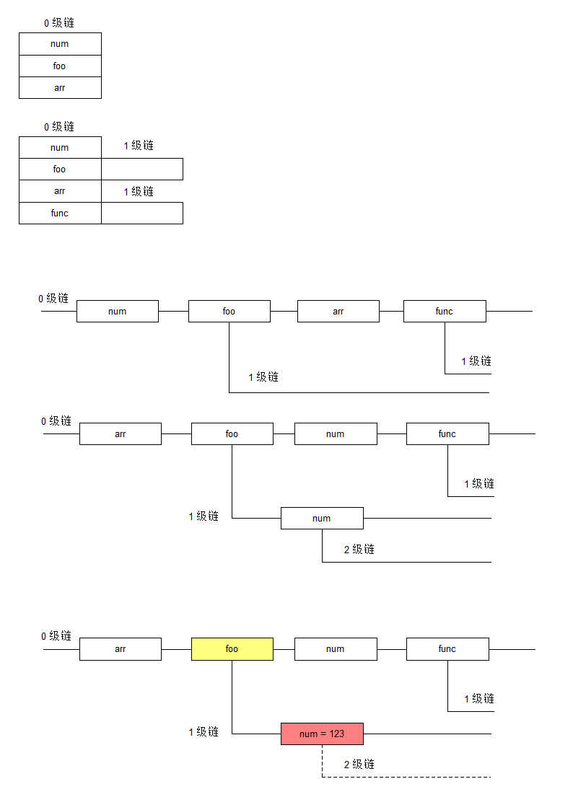

# 作用域

## 1.代码的预解析

预解析 提前的翻译解释, 在运行代码之前的一个解释

代码在执行之前, 需要快速的 "预览" 一遍. 那么可以尽可能提高执行效率

### 1.1 在 js 中预解析的特点

代码是如何执行的: 读取 js 文本, 预解析, 一句一句地执行

js 在预解析的过程中完成了声明部分的标记与变量作用域的设定

### 1.2 什么是 js 中的声明

简单的说就是让 js 执行引擎知道有什么东西( 标识符 )

即代码在执行之前的预解析, 首先让 js 的执行引擎知道在当前运行环境中有什么东西( 名字, 标识符 )是可以被使用的

js中的声明有

1. 标识符的声明( 变量的声明 )

2. 函数的声明

### 1.3 变量声明

在使用 var 声明变量, 同时完成赋值的时候. 实际上, 预解析将其做了一定处理:

1. 凡是读取到 var 的时候, 就检查 var 紧跟的名字是否已经标记了

2. 如果没有标记, 就表明这个名字是一个标识符, 需要被标记

3. 如果已经被标记了, 那么 这个 var 被忽略

如果在代码中有多个 var 后面紧跟的名字是一样的. 那么只有第一个 var 起作用，后面的所有 var 都会被自动的忽略

```js
    var a = 10;
    var b = 20;
    var a = 30; // 在预解析时发现a已经定义，则不会重复定义，当预解析完成，程序正式执行时会当成一个普通的赋值语句执行
```

#### 1.3.1 变量的提升

```js
    console.log(a);

    var a = 10;

    //控制台会打印undefined而不是报错a is not defined，说明预解析阶段，变量的声明会做提升，当执行控制台打印语句时，a已经定义了，只是没有赋值，此时就是undefined
```

### 1.4 函数声明

#### 1.4.1 函数的各种定义形式

声明式：

```js
    function func() {
        console.log('使用声明式定义');
    }
```

表达式式( 匿名函数, 字面量函数, lambda 函数 )：

```js
    var func = function () {
        console.log('使用表达式式定义');
    };
```

#### 1.4.2 函数声明的特点

1. 声明式函数声明是独立于语句.不需要加分号结束. 也不能嵌入到代码表达式中.

2. 表达式式, 本质上是使用函数表达式( 字面量 )给变量赋值. 因此它是语句.

#### 1.4.3 函数声明的提升

声明式：

```js
    fn(); //不报错，函数可以正常执行，说明预解析阶段做了函数声明提升，且函数名和函数体都进行了提升

    function fn(){
        console.log('函数执行');
    }
```

表达式式：

```js
    console.log(fn); //undefined

    fn(); //报错，fn is not a function，说明预解析阶段将fn当成一个普通的变量进行定义，函数体并没有被提升

    var fn = function () {
        console.log('函数执行');
    }
```

如果以上代码改成以下代码就会正常执行

```js
    var fn = function () {
        console.log('函数执行');
    }

    fn(); //正常执行
```

如果将变量的声明与函数的声明放在一起有些需要注意的情况：

函数的声明实际上包含两部分

1. 告诉解释器 xxx 名字已经可以使用( 函数名, 标识符 )

2. 告诉解释, 这个名字代表着一个函数( 变量里存储着函数的引用 )

当函数声明与变量声明冲突的时候. 只看谁先有数据.

```js
    console.log(fn); //fn函数的函数体

    var fn = 5;

    console.log(fn); //5 fn变量的的内容

    function fn() {
        console.log('执行函数');
    }
```

## 2.JS的词法作用域

词法: 就是定义, 书写代码的规则.

词法作用域就是描述变量的访问范围

1. 在代码中只有函数可以限定作用范围. 允许函数访问外部的变量. 反之不允许.

2. 在函数内优先访问内部声明的变量, 如果没有才会访问外部的.

3. 所有变量的访问规则, 按照预解析规则来访问

## 3.作用域链

作用域链是用来做变量查找的. 因此变量可以存储什么东西. 链中就应该有什么东西.

换句话说就是, 链里面存储的是各种对象. 可以将其想象成对象的序列( 数组 )

### 3.1 绘制作用域链的规则

1. 将所有的 script 标签作为一条链结构. 标记为 0 级别的链.
2. 将全局范围内, 所有的声明变量名和声明函数名按照代码的顺序标注在 0 级链中.
3. 由于每一个函数都可以构成一个新的作用域链. 所以每一个 0 级链上的函数都延展出 1 级链.
4. 分别在每一个函数中进行上述操作. 将函数中的每一个名字标注在 1 级链中.
5. 每一条 1 级链中如果有函数, 可以再次的延展出 2 级链. 以此类推.

例：绘制以下代码的作用域链

```js
    var num;

    function foo() {
        var num = 123;
        function num() {}
    }
    var arr = [];

    function func() {}

    foo();
```



### 3.2 分析代码的执行

当作用域链绘制完成后. 代码的的分析也需要一步一步的完成.

1. 根据代码的执行顺序( 从上往下, 从左至右 )在图中标记每一步的变量数据的变化

2. 如果需要访问某个变量. 直接在当前 n 级链上查找变量. 查找无序.

3. 如果找到变量, 直接使用. 如果没有找到变量在 上一级, n - 1 级中查找.

4. 一直找下去, 知直到 0 级链. 如果 0 级链还没有就报错. xxx is not defined.

## 4.闭包的概念

闭包的字面含义就是一个被包裹的隔离的空间

在 js 中函数是一个具有变量作用域隔离特性的一个内存结构, 即为一个闭包

### 4.1 闭包实现各种特性

闭包实现各种特性其根本的核心内容只有两个：

1. 带有私有数据的函数

```js
    function foo() {
        var num = 123;
        return function () {
            // 可以访问 num
        }
    }
    var func = foo();
    // 称 func 是一个 带有私有数据的 函数
    // 称 func 带有缓存
```

2. 带有私有数据的对象

```js
    function foo() {
        var num1 = 123,
            num2 = 456;
        return {
            get_num1: function () {
                return num1;
            },
            set_num1: function (value) {
                num1 = value;
            },
            get_num2: function () {
                return num2;
            }
        }; //返回了一个带有函数内部变量值的对象
    }

    var o = foo();

    //外部可以访问或设置内部变量的值
    console.log('num1 = ' + o.get_num1());
    console.log('num2 = ' + o.get_num2());

    o.set_num1(789);

    console.log('num1 = ' + o.get_num1());
    console.log('num2 = ' + o.get_num2());
```

### 4.2 闭包的应用__沙箱模式

沙箱就是一个隔离的执行环境

在全局作用域中，定义变量越多，出现冲突的可能性越大，同样也会污染全局作用域，使得代码执行效率降低

沙箱模式的典型格式：

```js
    //一个自调用函数
    (function () {
        // 沙箱模式

        // 所有的代码写在这里
    })();

    //类似于下面代码
    var f = function () {};
    f();
```

## 5.递归

### 5.1 递归的概念

递归就是直接或间接的调用自己

- 直接调用

```js
    function func() {
        // ...
        console.log(123);

        func(); // 递归了
        // ...
    }
```

- 间接调用

```js
    function func1() {
        func2();
    }

    function func2() {
        func1();
    }
```

以直接调用为例. 分析特点.

将函数调用想象成做一件事儿. 函数调用, 就是在做事儿.

递归, 就是函数在调用的时候, 转而去调用自己.

    就是

        要完成 xxx1, 就要先完成 xxx2

        要完成 xxx2, 就要先完成 xxx3

        要完成 xxx3, 就要先完成 xxx4

        其实就是将要做某件事儿, 转换成已经解决的问题. 然后根据逻辑关系找到临界条件( 已经解决的问题 )
