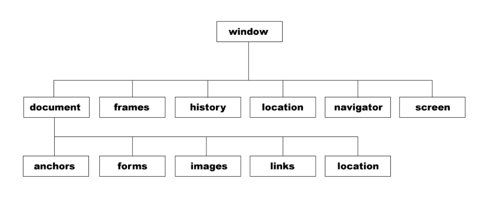

# BOM

## 1.基本概念

BOM 也叫浏览器对象模型，它提供了很多对象，用于访问浏览器的功能。BOM 缺少规范，每个浏览器提供商又按照自己想法去扩展它，那么浏览器共有对象就成了事实的标准 。所以，BOM 本身是没有标准的或者还没有哪个组织去标准它

## 2.window 对象

BOM 的核心对象是 window，它表示浏览器的一个实例。window 对象处于 JavaScript 结构的最顶层，对于每个打开的窗口，系统都会自动为其定义 window 对象



### 2.1 系统对话框

浏览器通过 alert()、confirm()和 prompt()方法可以调用系统对话框向用户显示信息。系统对话框与浏览器中显示的网页没有关系，也不包含 HTML

```js
//弹出警告
alert('Lee'); //直接弹出警告

//确定和取消
confirm('请确定或者取消'); //这里按哪个都无效
if (confirm('请确定或者取消')) { //confirm 本身有返回值
    alert('您按了确定！'); //按确定返回 true
} else {
    alert('您按了取消！'); //按取消返回 false
}

//输入提示框
var num = prompt('请输入一个数字', 0); //两个参数，一个提示，一个值
alert(num); //返回值可以得到
```

### 2.2 新建窗口

使用 window.open()方法可以导航到一个特定的 URL，也可以打开一个新的浏览器窗口 。

它可以接受四个参数：

1. 要加载的 URL；
2. 窗口的名称或窗口目标；
3. 一个特性字符串；
4. 一个表示新页面是否取代浏览器记录中当前加载页面的布尔值。

```js
open('http://www.baidu.com'); //新建页面并打开百度

open('http://www.baidu.com','baidu'); //新建页面并命名窗口并打开百度

open('http://www.baidu.com','_parent'); //在本页窗口打开百度,_blank 是新建

open('http://www.baidu.com','baidu','width=400,height=400,top=200,left=200,toolbar=yes'); //打开一个做了各种设置的窗口

//open 本身返回 window 对象
var box = open();
box.alert(''); //可以指定弹出的窗口执行 alert();

//子窗口操作父窗口
document.onclick = function () {
    opener.document.write('子窗口让我输出的！');
}
```

### 2.3 间歇调用和超时调用

JavaScript 是单线程语言，但它允许通过设置超时值和间歇时间值来调度代码在特定的时刻执行。前者在指定的时间过后执行代码，而后者则是每隔指定的时间就执行一次代码。

#### 2.3.1 超时调用

超时调用需要使用 window 对象的 setTimeout()方法，它接受两个参数：要执行的代码和毫秒数的超时时间。

```js
function box() {
    alert('Lee');
}
setTimeout(box, 1000); //直接传入函数名即可

setTimeout(function () { //推荐做法
    alert('Lee');
}, 1000);
```

调用 setTimeout()之后，该方法会返回一个数值 ID，表示超时调用。这个超时调用的 ID是计划执行代码的唯一标识符，可以通过它来取消超时调用。

要取消尚未执行的超时调用计划，可以调用 clearTimeout()方法并将相应的超时调用 ID 作为参数传递给它。

```js
var box = setTimeout(function () { //把超时调用的 ID 复制给 box
    alert('Lee');
}, 1000);
clearTimeout(box); //把 ID 传入，取消超时调用
```

#### 2.3.2 间歇调用

间歇调用与超时调用类似，只不过它会按照指定的时间间隔重复执行代码，直至间歇调用被取消或者页面被卸载。

设置间歇调用的方法是 setInterval()，它接受的参数与 setTimeout()相同：要执行的代码和每次执行之前需要等待的毫秒数。

```js
setInterval(function () { //重复不停执行
    alert('Lee');
}, 1000);
```

取消间歇调用方法和取消超时调用类似，使用 clearInterval()方法。但取消间歇调用的重要性要远远高于取消超时调用，因为在不加干涉的情况下，间歇调用将会一直执行到页面关
闭。

```js
var box = setInterval(function () { //获取间歇调用的 ID
    alert('Lee');
}, 1000);
clearInterval(box); //取消间歇调用
```

## 3.location 对象

location 是 BOM 对象之一，它提供了与当前窗口中加载的文档有关的信息，还提供了一些导航功能。事实上，location 对象是 window 对象的属性，也是 document 对象的属性 ；
所以 window.location 和 document.location 等效

### 3.1 location 对象的属性

- hash 如果该部分存在，表示锚点部分
- host 主机名：端口号
- hostname 主机名
- href 整个 URL
- pathname 路径名
- port 端口号
- protocol 协议部分
- search 查询字符串

### 3.2 location 对象的方法

- assign() 跳转到指定页面，与 href 等效
- reload() 重载当前 URL
- repalce() 用新的 URL 替换当前页面

## 4.history 对象

history 对象是 window 对象的属性，它保存着用户上网的记录，从窗口被打开的那一刻算起

### 4.1 history 对象的属性

- length history 对象中的记录数

### 4.2 history 对象的方法

- back() 前往浏览器历史条目前一个 URL，类似后退

- forward() 前往浏览器历史条目下一个 URL，类似前进

- go(num) 浏览器在 history 对象中向前或向后

>可以通过判断 history.length == 0，得到是否有历史记录

## 5.navigator 对象

一般使用 navigator.userAgent 返回客户端浏览器信息