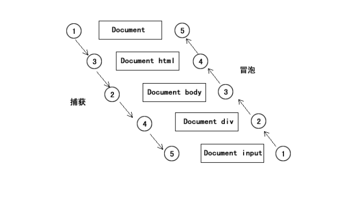

# 事件

事件一般是用于浏览器和用户操作进行交互，JavaScript 有三种事件模型：内联模型、脚本模型和 DOM2 模型

## 1.内联模型

这种模型是最传统接单的一种处理事件的方法。在内联模型中，事件处理函数是 HTML 标签的一个属性，用于处理指定事件。虽然内联在早期使用较多，但它是和 HTML 混写的 ，并没有与 HTML 分离。

```js
//在 HTML 中把事件处理函数作为属性执行 JS 代码
<input type="button" value="按钮" onclick="alert('Lee');" /> //注意单双引号

//在 HTML 中把事件处理函数作为属性执行 JS 函数
<input type="button" value="按钮" onclick="box();" /> //执行 JS 的函数
```

## 2.脚本模型

由于内联模型违反了 HTML 与 JavaScript 代码层次分离的原则。为了解决这个问题，我们可以在 JavaScript 中处理事件。这种处理方式就是脚本模型

```js
var input = document.getElementsByTagName('input')[0]; //得到 input 对象

input.onclick = function () { //匿名函数执行
    alert('Lee');
};
```

## 3.事件处理函数

### 3.1 鼠标事件

- click：当用户单击鼠标按钮或按下回车键时触发

- dblclick：当用户双击主鼠标按钮时触发

- mousedown：当用户按下了鼠标还未弹起时触发

- mouseup：当用户释放鼠标按钮时触发

- mouseover：当鼠标移到某个元素上方时触发

- mouseout：当鼠标移出某个元素上方时触发

- mousemove：当鼠标指针在元素上移动时触发

### 3.2 键盘事件

- keydown：当用户按下键盘上任意键触发，如果按住不放，会重复触发

- keypress：当用户按下键盘上的字符键触发，如果按住不放，会重复触发

- keyup：当用户释放键盘上的键触发

### 3.3 HTML 事件

- load：当页面完全加载后在 window 上面触发，或当框架集加载完毕后在框架集上触发

- select：当用户选择文本框(input 或 textarea)中的一个或多个字符触发

- change：当文本框(input 或 textarea)内容改变且失去焦点后触发

- focus：当页面或者元素获得焦点时在 window 及相关元素上面触发

- blur：当页面或元素失去焦点时在 window 及相关元素上触发

- submit：当用户点击提交按钮在form元素上触发

- reset：当用户点击重置按钮在form元素上触发

- resize：当窗口或框架的大小变化时在 window 或框架上触发

- scroll：当用户滚动带滚动条的元素时触发

## 4.事件对象

事件对象，我们一般称作为 event 对象，这个对象是浏览器通过函数把这个对象作为参数传递过来的，直接通过接收参数来得到即可

```js
input.onclick = function (e) { //这里的参数e就代表事件对象
    //事件函数体
};
```

直接接收 event 对象，是 W3C 的做法，IE 不支持，IE 自己定义了一个 event 对象，直接在 window.event 获取即可

```js
input.onclick = function (evt) {
    var e = evt || window.event; //实现跨浏览器兼容获取 event 对象
};
```

使用e.target可以获得当前触发该事件的dom对象

### 4.1 事件对象的三个重要坐标

- clientX clientY 在浏览器上的位置

- pageX pageY 在页面上的位置

page 有兼容问题，client 没有，我们可以用 client 来计算

```js
var pageX = event.pageX || event.clientX + document.documentElement.scrollLeft;

var pageY = event.pageY || event.clientY + document.documentElement.scrollTop;
```

### 4.2 事件流

事件流是描述的从页面接受事件的顺序，当几个都具有事件的元素层叠在一起的时候 ，那么你点击其中一个元素，并不是只有当前被点击的元素会触发事件，而层叠在你点击范围的所有元素都会触发事件。

事件流包括两种模式：冒泡和捕获

事件冒泡，是从里往外逐个触发。事件捕获，是从外往里逐个触发。那么现代的浏览器默认情况下都是冒泡模型，而捕获模式则是早期的 Netscape 默认情况。而现在的浏览器要使用 DOM2 级模型的事件绑定机制才能手动定义事件流模式



阻止事件冒泡

event.stopPropagation();停止传播，防止冒泡

event.cancelBubble 阻止冒泡 ie678

### 4.3 DOM2 级事件

为了解决之前事件绑定中重复绑定事件会覆盖之前的事件，以及无法指定事件流是冒泡还是捕获的问题，于是提出了DOM2 级事件的概念

```js
window.addEventListener('load', function () {
    alert('Lee');
}, false);
```

W3C 的现代事件绑定比我们自定义的好处就是：1.不需要自定义了；2.可以屏蔽相同的函数；3.可以设置冒泡和捕获

