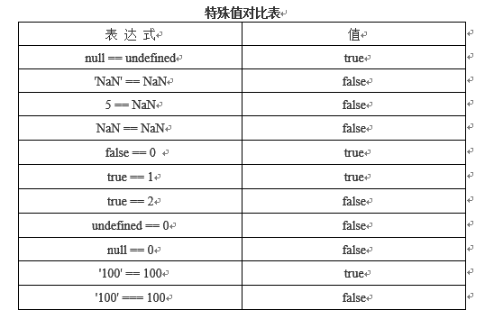

# 1.运算符

## 1.1 一元运算符

### 1.1.1 递增++ 递减--

a++ //先参与运算，后自增1

++a //先自加 后参与运算

递减同理

例如：

~~~javascript
var a = 1;
console.log(a++); //1 先参与运算 再自增
console.log(a); //2
var b = 1;
console.log(++b); //2 先自增 在参与运算
console.log(b); //2
~~~

### 1.1.2 加号+和减号-

加运算规则如下：

- 对于数值，不会产生任何影响
- 数值字符串转换成数值
- 字符串包含非数值转成NaN
- 布尔值转换成相应数值
- 对象不设置toString或valueOf即为NaN

~~~javascript
var box = 100; +box;	//100，对于数值，不会产生任何影响
var box = '89'; +box;	//89，数值字符串转换成数值
var box = 'ab'; +box;	//NaN，字符串包含非数值转成NaN
var box = false; +box;	//0，布尔值转换成相应数值
var box = 2.3; +box;	//2.3，没有变化
var box = {				//1，不设置toString或valueOf即为NaN
	toString : function() {
		return 1;
	}
};			+box;
~~~

减运算规则如下：

- 对于数值，直接变负
- 数值字符串转换成数值(负值)
- 字符串包含非数值转成NaN
- 布尔值转换成相应数值
- 对象不设置toString或valueOf即为NaN

~~~javascript
var box = 100; -box; //-100，对于数值，直接变负
var box = '89'; -box; //-89，数值字符串转换成数值
var box = 'ab'; -box; //NaN，字符串包含非数值转成NaN
var box = false; -box; //0，布尔值转换成相应数值
var box = 2.3; -box; //-2.3，没有变化
var box = { //-1，不设置toString或valueOf即为NaN
toString : function() {
        return 1;
    }
}; -box;
~~~

> 注意：加法和减法运算符一般用于算术运算，也可按上面的规则进行类型转换

## 1.2 算数运算符

ECMAScript定义了5个算术运算符，加+、减-、乘*、除/、求模%(取余)。如果在算术运算的值不是数值，那么后台会先使用Number()转型函数将其转换为数值(隐式转换)

### 1.2.1 加法+

~~~javascript
var box = 1 + 2;//等于3
var box = 1 + NaN;//NaN，只要有一个NaN就为NaN
var box = Infinity + Infinity;//Infinity
var box = -Infinity + -Infinity;//-Infinity
var box = Infinity + -Infinity;//NaN，正无穷和负无穷相加等NaN
var box = 100 + '100';//100100，字符串连接符，有字符串就不是加法
var box = '您的年龄是：' + 10 + 20;//您的年龄是：1020，被转换成字符串
var box = 10 + 20 + '是您的年龄';//30是您的年龄，没有被转成字符串
var box = '您的年龄是：' + (10 + 20);	//您的年龄是：30，没有被转成字符串
var box = 10 + 对象//10[object Object]，如果有toString()或valueOf()则返回10+返回数的值
~~~

### 1.2.2 减法-

~~~javascript
var box = 100 - 70;//等于30
var box = -100 - 70//等于-170
var box = -100 - -70//-30，一般写成-100 - (-70)比较清晰
var box = 1 - NaN;//NaN，只要有一个NaN就为NaN
var box = Infinity - Infinity;//NaN
var box = -Infinity - -Infinity;//NaN
var box = Infinity - -Infinity;//Infinity
var box = -Infinity - Infinity;//-Infinity
var box = 100 - true;//99，true转成数值为1
var box = 100 - '';//100，''转成了0
var box = 100 - '70';//30，'70'转成了数值70
var box = 100 - null;//100，null转成了0
var box = 100 - 'Lee';//NaN，Lee转成了NaN
var box = 100 - 对象//NaN，如果有toString()或valueOf()则返回10-返回数的值
~~~

### 1.2.3 乘法*

~~~javascript
var box = 100 * 70;//7000
var box = 100 * NaN;//NaN，只要有一个NaN即为NaN
var box = Infinity * Infinity;//Infinity
var box = -Infinity * Infinity ;//-Infinity
var box = -Infinity * -Infinity ;//Infinity
var box = 100 * true;//100，true转成数值为1
var box = 100 * '';//0，''转成了0
var box = 100 * null;//0，null转成了0
var box = 100 * 'Lee';//NaN，Lee转成了NaN
var box = 100 * 对象//NaN，如果有toString()或valueOf()则返回10 - 返回数的值
~~~

### 1.2.4 除法/

~~~javascript
var box = 100 / 70;//1.42....
var box = 100 / NaN;//NaN
var box = Infinity / Infinity;//NaN
var box = -Infinity / Infinity ;//NaN
var box = -Infinity / -Infinity;//NaN
var box = 100 / true;//100，true转成1
var box = 100 / '';//Infinity，
var box = 100 / null;//Infinity，
var box = 100 / 'Lee';//NaN
var box = 100 / 对象;//NaN，如果有toString()或valueOf()则返回10 / 返回数的值
~~~

### 1.2.5 取余%

~~~javascript
var box = 10 % 3;//1，余数为1
var box = 100 % NaN;//NaN
var box = Infinity % Infinity;//NaN
var box = -Infinity %  Infinity ;//NaN
var box = -Infinity %  -Infinity;//NaN
var box = 100 %  true;//0
var box = 100 %  '';//NaN
var box = 100 %  null;//NaN
var box = 100 %  'Lee';//NaN
var box = 100 %  对象;//NaN，如果有toString()或valueOf()则返回10 % 返回数的值
~~~

## 1.3 关系运算符

用于进行比较的运算符称作为关系运算符：小于(<)、大于(>)、小于等于(<=)、大于等于(>=)、相等(==)、不等(!=)、全等(恒等)(===)、不全等(不恒等)(!==)

和其他运算符一样，当关系运算符操作非数值时要遵循以下规则：

1. 两个操作数都是数值，则数值比较；
2. 两个操作数都是字符串，则比较两个字符串对应的字符编码值；
3. 两个操作数有一个是数值，则将另一个转换为数值，再进行数值比较；
4. 两个操作数有一个是对象，则先调用valueOf()方法或toString()方法，再用结果比较；

~~~javascript
var box = 3 > 2;//true
var box = 3 > 22;//false
var box = '3' > 22;//false
var box = '3' > '22';//true
var box = 'a' > 'b';//false  a=97,b=98
var box = 'a' > 'B';//true	B=66
var box = 1 > 对象;//false，如果有toString()或valueOf()则返回1 > 返回数的值
~~~

在相等和不等的比较上，如果操作数是非数值，则遵循以下规则：

1. 一个操作数是布尔值，则比较之前将其转换为数值，false转成0，true转成1；
2. 一个操作数是字符串，则比较之前将其转成为数值再比较；
3. 一个操作数是对象，则先调用valueOf()或toString()方法后再和返回值比较；
4. 不需要任何转换的情况下，null和undefined是相等的；
5. 一个操作数是NaN，则==返回false，!=返回true；并且NaN和自身不等；
6. 两个操作数都是对象，则比较他们是否是同一个对象，如果都指向同一个对象，则返回true，否则返回false。
7. 在全等和全不等的判断上，比如值和类型都相等，才返回true，否则返回false。

~~~javascript
var box = 2 == 2;//true
var box = '2' == 2;//true，'2'会转成成数值2
var box = false == 0;//true，false转成数值就是0
var box = 'a' == 'A';//false，转换后的编码不一样
var box = 2 == {};//false，执行toString()或valueOf()会改变
var box = 2 == NaN;//false，只要有NaN，都是false
var box = {} == {};//false，比较的是他们的地址，每个新创建对象的引用地址都不同
var age = {};
var height = age;
var box = age == height;//true，引用地址一样，所以相等
var box = '2' === 2//false，值和类型都必须相等
var box = 2 !== 2//false，值和类型都相等了
~~~

## 1.4 逻辑运算符

逻辑运算符通常用于布尔值的操作，一般和关系运算符配合使用，有三个逻辑运算符：逻辑与(&&)、逻辑或(||)、逻辑非(!)

### 1.4.1 逻辑与(&&)

运算符两边都为true，返回true，否则返回false

如果两边的操作数有一个操作数不是布尔值的情况下，与运算就不一定返回布尔值，此时，遵循已下规则：

1. 第一个操作数是对象，则返回第二个操作数；
2. 第二个操作数是对象，则第一个操作数返回true，才返回第二个操作数，否则返回false;
3. 有一个操作数是null，则返回null；
4. 有一个操作数是undefined，则返回undefined。

~~~javascript
var box = 对象 && (5 > 4);//true，返回第二个操作数
var box = (5 > 4) && 对象;//[object Object]
var box = (3 > 4) && 对象;//false
var box = (5 > 4) && null;//null
~~~

>__重点__：逻辑与运算符属于短路操作，顾名思义，如果第一个操作数返回是false，第二个数不管是true还是false都返回的false

### 1.4.2 逻辑或(||)

两边只要有一边是true，返回true

如果两边的操作数有一个操作数不是布尔值的情况下，逻辑与运算就不一定返回布尔值，此时，遵循已下规则：

1. 第一个操作数是对象，则返回第一个操作数；
2. 第一个操作数的求值结果为false，则返回第二个操作数；
3. 两个操作数都是对象，则返回第一个操作数；
4. 两个操作数都是null，则返回null；
5. 两个操作数都是NaN，则返回NaN；
6. 两个操作数都是undefined，则返回undefined；

~~~javascript
var box = 对象 || (5 > 3);//[object Object]
var box = (5 > 3) || 对象;//true
var box = 对象1 || 对象2;//[object Object]
var box = null || null;//null
var box = NaN || NaN;//NaN
var box = undefined || undefined;//undefined
~~~

>__重点__：和逻辑与运算符相似，逻辑或运算符也是短路操作。当第一操作数的求值结果为true，就不会对第二个操作数求值了

### 1.4.3 逻辑非(!)

逻辑非运算符可以用于任何值。无论这个值是什么数据类型，这个运算符都会返回一个布尔值。它的流程是：先将这个值转换成布尔值，然后取反，规则如下：

1. 操作数是一个对象，返回false；
2. 操作数是一个空字符串，返回true；
3. 操作数是一个非空字符串，返回false；
4. 操作数是数值0，返回true；
5. 操作数是任意非0数值(包括Infinity)，false；
6. 操作数是null，返回true；
7. 操作数是NaN，返回true；
8. 操作数是undefined，返回true；

~~~javascript
var box = !(5 > 4);//false
var box = !{};//false
var box = !'';//true
var box = !'Lee';//false
var box = !0;//true
var box = !8;//false
var box = !null;//true
var box = !NaN;//true
var box = !undefined;//true
~~~

使用一次逻辑非运算符，流程是将值转成布尔值然后取反。而使用两次逻辑非运算符就是将值转成成布尔值取反再取反，相当于对值进行Boolean()转型函数处理

~~~javascript
var box = !!0;//false
var box = !!NaN;//false
~~~

## 1.5 赋值运算符

赋值运算符用等于号(=)表示，就是把右边的值赋给左边的变量。

~~~javascript
var box = 100;//把100赋值给box变量
~~~

复合赋值运算符通过x=的形式表示，x表示算术运算符及位运算符。

~~~javascript
var box = 100;
box = box + 100;//200，自己本身再加100
~~~

这种情况可以改写为：

~~~javascript
var box = 100；
box += 100;//200，+=代替box+100
~~~

除了这种+=加/赋运算符，还有其他的几种如下：

1. 乘/赋(*=)
2. 除/赋(/=)
3. 模/赋(%=)
4. 加/赋(+=)
5. 减/赋(-=)
6. 左移/赋(<<=)
7. 有符号右移/赋(>>=)
8. 无符号有移/赋(>>>=)

## 1.6 其它运算符

### 1.6.1 字符串运算符

字符串运算符只有一个，即："+"。它的作用是将两个字符串相加。

规则：至少一个操作数是字符串即可。

~~~javascript
var box = '100' + '100';//100100
var box = '100' + 100;//100100
var box = 100 + 100;//200
~~~

### 1.6.2 逗号运算符

逗号运算符可以在一条语句中执行多个操作。

~~~javascript
var box = 100, age = 20, height = 178;//多个变量声明
var box = (1,2,3,4,5);//5，变量声明，将最后一个值赋给变量，不常用
var box = [1,2,3,4,5];//[1,2,3,4,5]，数组的字面量声明
var box = {//[object Object]，对象的字面量声明
	1 : 2,
	3 : 4,
	5 : 6
};
~~~

### 1.6.3 三元条件运算符

三元条件运算符其实就是后面将要学到的if语句的简写形式。

~~~javascript
var box = 5 > 4 ? '对' : '错';//对，5>4返回true则把'对'赋值给box，反之。
//相当于：
var box = '';//初始化变量
if (5 > 4) {//判断表达式返回值
	box = '对';					//赋值
} else {
	box = '错';					//赋值
}
~~~

### 1.7 运算符优先级

在一般的运算中，我们不必考虑到运算符的优先级，因为我们可以通过圆括号来解决这种问题。比如：

~~~javascript
var box = 5 - 4 * 8;//-27
var box = (5 - 4) * 8;//8
~~~

但如果没有使用圆括号强制优先级，我们必须遵循以下顺序

- . [] ()	对象成员存取、数组下标、函数调用等
- ++ \-- ~ ! delete new typeof void	一元运算符
- \* / % 	乘法、除法、去模
- \+ \- +	加法、减法、字符串连接
- << >> >>>	移位
- < <= > >= instanceof	关系比较、检测类实例
- == != === !==	恒等(全等)
- &	位与
- ^	位异或
- |	位或
- &&	逻辑与
- ||	逻辑或
- ?:	三元条件
- = x=	赋值、运算赋值
- ,	多重赋值、数组元素