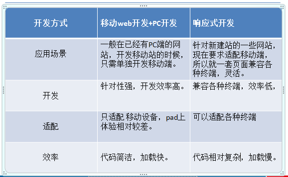

# 移动与响应式开发

## 1.适配解决方案

### 1.1 流式布局

流式布局就是百分比布局，通过盒子的宽度设置成百分比(100%)来根据屏幕的宽度来进行伸缩

特点：不受固定像素的限制，内容向两侧填充

### 1.2 单位使用rem

先要了解px、em、rem这三者的区别

- px

    px像素（Pixel）。相对长度单位。像素px是相对于显示器屏幕分辨率而言的，所以对于开发者而言，其更像是一个绝对单位

- em

    em是相对长度单位。相对于当前对象内文本的字体尺寸。如当前对行内文本的字体尺寸未被人为设置，则相对于浏览器的默认字体尺寸

    某元素的父级设置了一个字体大小，则它的子级元素设置em单位就是相对于该字体大小进行设定的，em的变数特别多，一个不注意就可能搞不清当前元素的em单位是相对于哪个父级元素而言的了

- rem

    rem是CSS3新增的一个相对单位（root em，根em），rem为元素设定字体大小时，仍然是相对大小，但相对的只是HTML根元素。

    这个单位可谓集相对大小和绝对大小的优点于一身，通过它既可以做到只修改根元素就成比例地调整所有字体大小，又可以避免字体大小逐层复合的连锁反应

这样只要针对不同屏幕大小的设备设置不同的HTML根元素字体大小，所有CSS的度量值不需要修改就可以做到不同设备的适配

比较实用的解决方案：[手机淘宝lib-flexible适配方案](https://github.com/amfe/lib-flexible/tree/master)

### 1.3 viewport视口

- 定义

    在移动端用来承载网页的这个区域，就是我们的视觉窗口，也叫viewport（视口）, 这个区域可是设置高度宽度，可是按比例放大缩小，而且能设置是否允许用户自行缩放

- 参数

    - width 宽度设置的是viewport宽度，可以设置device-width特殊值

    - initial-scale 初始缩放比，大于0的数字

    - maximum-scale 最大缩放比，大于0的数字

    - minimum-scale 最小缩放比，大于0的数字

    - 是否用户缩放，yes或no（1或0）

- 常用的移动web视口参数设置

    ```html
    <meta name="viewport" content="width=device-width, user-scalable=no, initial-scale=1.0, maximum-scale=1.0,minimum-scale=1.0"/>
    ```

## 2.移动端常见样式初始化

- 点击高亮去除

    ```-webkit-tap-highlight-color : transparent;```

- 盒子以边框开始计算

    ```-webkit-box-sizing: border-box;box-sizing: border-box;```

- 表单组件默认样式去除

    ```-webkit-appearance: none;```

- 最大、最小宽度限制

    ```max-width: 设计稿最大宽度;(目前在行业当中的移动端的设计图一般使用的是640px)```

    ```min-width: 320px;(在移动设备当中现在最小的尺寸320px iphone5)```

- img下间隙问题

    一般移动端图片都是由a标签包裹，将a标签和img一起设定为block元素

## 3.图片模糊的原因及解决办法

原因：移动端设备尺寸小，但屏幕像素点密度高，会用2个或多个物理像素点来显示1个图片的像素点，这样等于是把图片放大显示了

设计时使用2倍图，开发时将图片大小除2进行设定(根据实际情况甚至会出现3倍图)

## 4.触摸事件

触摸事件需要以事件监听的方式添加，且只有移动端浏览器中存在

- touchstart触摸开始事件

- touchmove触摸移动事件

- touchend触摸结束事件

三个事件都可以通过其事件对象中的属性获取到当前触摸对象数组TouchList

- e.targetTouches 目标元素的所有当前触摸
- e.changedTouches 页面上最新更改的所有触摸
- e.touches 页面上的所有触摸

其中touchend触摸结束事件由于是在触摸结束时发生，e.targetTouches和e.touches已不能获得触摸对象，可以用e.changedTouches获得触摸结束时改变的触摸

一般都使用触摸对象数组TouchList的第0项的触摸对象作为参照完成很多功能

触摸对象中有许多获取触摸位置坐标的属性

- clientX:触摸目标在视口中的X坐标。
- clientY:触摸目标在视口中的Y坐标。
- pageX:触摸目标在页面中的x坐标。
- pageY:触摸目标在页面中的y坐标。
- screenX:触摸目标在屏幕中的x坐标。
- screenY:触摸目标在屏幕中的y坐标。

## 5.过渡与动画结束事件

- transitionEnd 过渡动画结束后触发

```js
dom.addEventListener('webkitTransitionEnd', function (e) {});
dom.addEventListener('transitionEnd', function (e) {});
```

- animationEnd 动画结束后触发

```js
dom.addEventListener('webkitAnimationEnd',function(e){ });
dom.addEventListener('animationEnd',function(e){ });
```

## 6.移动端轻触事件原理

由于在移动端click会有300ms左右的延时，为了响应速度更快移动端框架一般会封装一个加tap的事件

利用touch事件当没有滑动过并且响应时间在一定的时间内（比click快）那么这样的一个过程就是一个tap事件

```js
var tap = function (dom, callback) {
    /*
        * 要求  没有触发 touchmove 事件
        *       并且响应速度要比click快
        */
    if (dom && typeof dom == 'object') {
        var isMove = false;
        var startTime = 0;
        dom.addEventListener('touchstart', function (e) {
            //console.log('touchstart');
            //console.time('tap');/*记录tap这个参数现在的时间*/
            startTime = Date.now();
        });
        dom.addEventListener('touchmove', function (e) {
            //console.log('touchmove');
            isMove = true;
        });
        dom.addEventListener('touchend', function (e) {
            //console.log('touchend');
            //console.timeEnd('tap')/*打印tap这个参数距离上一次记录的时候的时间*/
            /*判读  是否满足tap 的要求  一般要求tap的响应时间150*/
            if (!isMove && (Date.now() - startTime) < 150) {
                /*调用 callback*/
                callback && callback(e);
            }
            /*重置 参数*/
            isMove = false;
            startTime = 0;
        });
    }
}
```

## 7.响应式开发

### 7.1 产生原因及定义

在移动互联日益成熟的时候，我们在桌面浏览器上开发的网页已经无法满足移动设备的阅读

这时通常的做法是针对移动端单独做一套特定的版本

但是如果终端越来越多，需要开发的版本也就会越来越多

为了减少开发的版本，最好能做到一个网站能够同时兼容多个终端，于是响应式开发应运而生

### 7.2 响应式开发原理

响应式开发主要运用的就是CSS3中的Media Query（媒介查询）

通过查询screen的宽度来指定某个宽度区间的网页布局

- 超小屏幕（移动设备） 768px以下 ```@media screen and (max-width:768px)```

- 小屏设备  768px-992px ```@media screen and (min-width:768px) and (max-width:992px)```

- 中等屏幕  992px-1200px ```@media screen and (min-width:992px) and (max-width:1200px)```

- 宽屏设备  1200px以上 ```@media screen and (min-width:1200px)```

### 7.3 响应式开发和移动web开发的区别



### 7.4 使用Bootstrap框架开发响应式网站

由于响应式开发从零开始做复杂度较高，最好的办法是借助一些框架来辅助开发，其中使用度最高的框架就是Bootstrap，利用Bootstrap框架可以比较方便地搭建一个响应式网站的静态页面

详细资料可以参阅

Bootstrap中文网：[http://www.bootcss.com/](http://www.bootcss.com/)